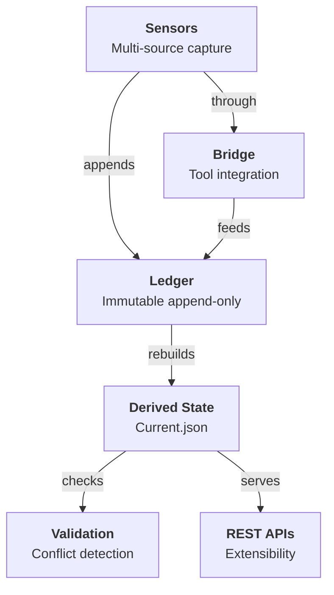

# Chapter 1: The Problem & Core Abstractions

## The Disappearing Decision

Decisions vanish. A team chooses React for the core UI. They document it in a Slack thread that scrolls into the archive. Months later, someone new proposes Vue. The team asks "why did we pick React?". No one remembers. Someone finds the Slack thread. It says "team expertise and ecosystem maturity." But the thread is dead now. Vue proposal moves forward. Weeks in, the original React expert pushes back. Rework happens. Cost multiplies.

This pattern repeats because decisions exist in multiple places and belong to none:
- Meeting notes (scattered across Google Docs)
- Slack threads (ephemeral, hard to search)
- Code comments (tool-specific, hard to reference)
- Notion database (out of sync, abandoned after sprint)
- PRs (mixed with implementation, hard to extract intent)

The source of truth doesn't exist. So decisions don't survive tool transitions. When the team moves from Slack to Discord, decisions are lost. When someone new joins and reads the codebase, they don't know *why* this architecture was chosen. When leadership changes tools (Figma → Pencil.dev, or vice versa), design decisions vanish.

## Why This Matters

Three costs compound:

**Rework:** A decision made once gets re-litigated. "Why did we choose this database?" becomes "Should we switch databases?" Which becomes weeks of investigation. If the original decision had been visible, the answer was already there.

**Onboarding friction:** New engineers waste time re-understanding what was already decided. They read code and infer intent instead of reading intent and understanding code. This inverts the relationship.

**Conflict invisibility:** Two teams make contradictory decisions in parallel because neither sees the other's work. A backend team decides "use PostgreSQL" while a data team decides "use DynamoDB." The conflict emerges at integration time, not decision time. Earlier detection saves months.

This problem is acute enough that smart teams build custom solutions. Amol Avasare, Head of Growth at Anthropic, built a weekly AI agent that scans Slack conversations across projects to surface cross-functional misalignment—places where teams are about to do overlapping work or pull in different directions. The agent caught major conflicts that would have caused weeks of wasted effort. He built this because decision conflicts are *that expensive*. [Source: Lenny Rachitsky interview with Amol Avasare, "My biggest takeaways from Anthropic's Head of Growth," LinkedIn, 2024]

## The IRP Solution: Ledger as Source of Truth

IRP inverts the problem. Instead of decisions being a consequence of documentation, documentation becomes a consequence of deciding.

When you decide something, you capture it immediately: "Use React for the core UI. Why: team expertise, ecosystem maturity."

That entry is immutable. It lives in a ledger. The ledger is the source of truth. Everything else—current.json, REST APIs, Figma integrations—derives from the ledger.

Consequence: decisions are portable. A decision captured in Figma lives in `.irp/ledger.jsonl`. It can be queried from Slack, injected into an AI model's context, or referenced in a PR. The decision travels with the work.

## Core Abstraction: The Decision Entry

A decision in IRP is minimal:

```
{
  "type": "decision",
  "id": "IRP-2026-04-12-001",
  "what": "Use React for the core UI",
  "why": "Team expertise, ecosystem maturity",
  "confidence": "high",
  "timestamp": "2026-04-12",
  "source": "figma",
  "tags": ["frontend", "framework"]
}
```

This is enough. No lengthy justification, no approval chains, no metadata. Just: what was decided, why it matters, and confidence level.

The `source` field indicates origin (Figma plugin, Slack, CLI, etc.). The `confidence` field indicates certainty (low/medium/high). Both enable downstream reasoning.

## Core Abstraction: The Immutable Ledger

The ledger is a JSONL file: one JSON object per line.

```
{"type":"decision","id":"IRP-2026-04-12-001","what":"...","why":"..."}
{"type":"decision","id":"IRP-2026-04-12-002","what":"...","why":"..."}
```

Append-only. Never overwrite. Never delete.

Why JSONL instead of a database?

1. **Portability:** A JSONL file is a text file. You can version it, email it, archive it. It survives tool death.

2. **Streaming:** You can append a decision without reading the whole file. Each line is atomic.

3. **Resilience:** If one line is corrupted, the rest of the ledger is intact. A JSON database corruption could be catastrophic.

4. **Auditability:** Every decision is logged in order. You can inspect the ledger directly, no API required.

This design choice reflects a principle: **decisions should survive infrastructure change.** SQLite dies, JSONL lives.

## Core Abstraction: Derived State (current.json)

Humans don't want to read the entire ledger to answer "what have we decided lately?" So IRP derives a **current state** from the ledger.

`current.json` contains the last 10 active decisions:

```json
{
  "version": 1,
  "active": [
    {"id": "IRP-2026-04-12-001", "what": "...", "why": "...", ...},
    {"id": "IRP-2026-04-12-002", "what": "...", "why": "...", ...}
  ]
}
```

This file is **derived**, not stored. It's rebuilt every time the ledger changes. So it's always consistent with the ledger by construction. No sync problems. No divergence.

Why last 10 only? Scope management. Focus on recent decisions. Don't distract the team with "we used CoffeeScript in 2014" (it's in the ledger, but not in the active decisions).

## Design Principle: Durability Without Friction

Here's the critical design choice: **checks don't block.**

When a team proposes a new decision, IRP runs a validation check. If it conflicts with an active decision, IRP surfaces the conflict. But it doesn't prevent the capture. The decision is logged anyway.

Why?

Because blocking creates friction. "Check failed, let me file a ticket, wait for approval, try again." That's slow. And it's fragile: the person enforcing the check might be wrong. The conflict might be intentional (we're deliberately changing the decision). Blockers assume someone centralized can make the right call, but in most organizations, teams need autonomy.

So IRP informs instead. It says "you're proposing X, but we decided Y in IRP-2026-04-10-003." The team sees it, discusses it, and decides. If they want to abandon their proposal, they can. If they want to override the old decision, they can. If they want to proceed anyway, they can. The decision is logged either way.

This design reflects a principle: **conflict detection is hygiene, not policy.**

## Integration: How Decisions Enter the System

Decisions don't enter IRP via a single interface. They enter through sensors:

- **Figma sensor:** Plugin embeds decision capture in Figma. Designer makes a choice → captures it immediately.
- **Slack sensor:** Slack app watches threads. Team discusses → app offers capture.
- **CLI:** `irp capture` for headless/scripted entry.
- **REST API:** External systems POST decisions to IRP.

Each sensor is independent. If the Figma plugin breaks, Slack capture still works. If both are offline, teams can still use the CLI.

All sensors feed into the same ledger. All append to the same JSONL file. So the ledger is the union of all decision sources.

This architecture reflects a principle: **decisions should be tool-independent.**

## Core Abstractions in One Diagram



## Summary: Why This Matters

IRP makes decisions portable. A decision captured in Figma can inform a Slack conversation, which can inform a Claude API call. The decision travels without re-entry friction. No "let me copy this to Slack," no "let me paste this into the prompt." The decision moves because it's centralized in `.irp/` and accessible everywhere.

Next chapter: how does IRP keep decisions in sync across tools, and what happens when conflicts emerge?

## Apply This

**Pattern 1: Immutable Audit Log**
- **Problem solved:** Lossy tool transitions, hidden history
- **How to adapt:** Define "decision" minimally, append-only storage, version the schema
- **Pitfall to watch:** Don't try to retroactively update history. If you need to revise, log a new entry that supersedes the old one.

**Pattern 2: Derived State Over Dual Storage**
- **Problem solved:** Consistency without sync problems
- **How to adapt:** Identify your "source truth" (ledger) and derived view (current). Rebuild on every mutation.
- **Pitfall to watch:** Don't cache derived state without invalidation. If you cache, you'll diverge.

**Pattern 3: Sequential, Human-Readable IDs**
- **Problem solved:** Easy querying, no UUID noise, date scoping
- **How to adapt:** Encode context (date, sequence, domain) in the ID. Make them deterministic.
- **Pitfall to watch:** Don't change ID format mid-flight. It's a breaking change. Pick a scheme and stick with it.

**Pattern 4: Tool-Neutral Data Format**
- **Problem solved:** Avoid lock-in to single tool
- **How to adapt:** Keep entry format minimal and portable (JSON, not binary or tool-specific format)
- **Pitfall to watch:** Don't over-generalize. Keep the format tight. Every field should earn its place.

**Pattern 5: Non-Blocking Validation**
- **Problem solved:** Inform stakeholders without friction
- **How to adapt:** Separate "validation" (detection) from "enforcement" (policy). Detect widely, enforce narrowly.
- **Pitfall to watch:** Don't let non-blocking warnings become invisible. Make them loud. Make teams see them.
