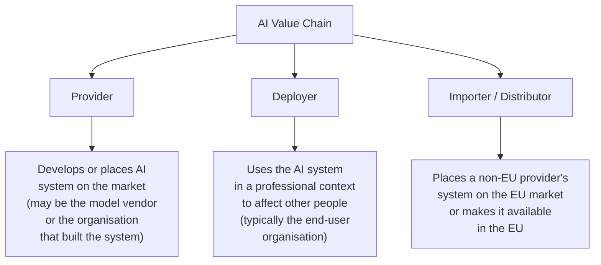
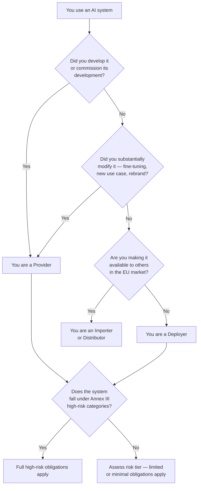
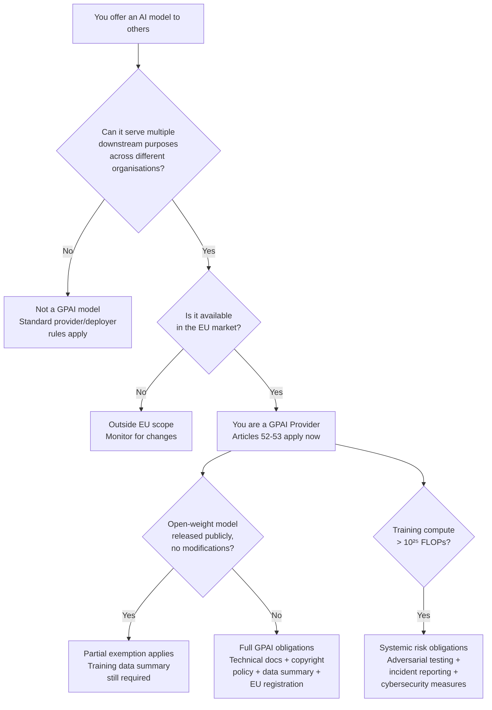

# Chapter 10: Who It Applies To

## The Question Every Organisation Gets Wrong

Chapter 9 established why the EU AI Act exists: to close the accountability gap that lets consequential AI decisions happen without a human responsible for them. Before you can understand what obligations apply to you, you need to answer a more fundamental question: what *role* does your organisation play in the AI value chain?

Most organisations ask the wrong question first. They ask "do we use AI?" — and when the answer is yes, they assume the Act applies to them in its entirety. This is both too broad and too narrow. Too broad because many uses of AI carry minimal obligations. Too narrow because organisations that believe they are "just using" an AI system may in fact bear provider-level responsibility for it.

The AI Act does not regulate organisations. It regulates *roles*. The same organisation can simultaneously hold multiple roles across different systems. Understanding your role — or roles — is the essential first step.

## The Three Roles

### Provider

A Provider is any organisation that develops an AI system and places it on the market — or puts it into service under its own name or trademark. If you built the system, you are likely the Provider. If you took a foundation model, fine-tuned it substantially, and sell the result as your own product, you are the Provider for that product.

Provider obligations are the heaviest in the Act. For high-risk AI systems, Providers must: conduct a conformity assessment, maintain technical documentation, register the system in an EU database, affix a CE marking where applicable, implement a quality management system, and maintain post-market monitoring. These are not one-time tasks. They are ongoing operational obligations.

The critical nuance: "placing on the market" does not require selling to external customers. If you develop an AI system for internal use within your organisation and deploy it at scale to affect people's lives (employees, customers, applicants), regulators may treat you as the Provider. Many organisations are both Provider and Deployer of their own internal systems.

### Deployer

A Deployer is any organisation that uses an AI system in a professional context — meaning not for purely personal use. If you buy or license an AI product from a vendor and use it in your operations, you are the Deployer. The HR team using an AI screening tool. The bank using a credit-scoring model. The municipality using a benefits-eligibility system. All Deployers.

Deployers have a shorter list of obligations than Providers, but they are not off the hook. Deployers must: ensure the system is used in accordance with its Instructions for Use, assign human oversight, conduct Fundamental Rights Impact Assessments where required, inform employees when AI systems monitor or affect them, and report serious incidents. They are also responsible for ensuring the system is not used for purposes other than those intended by the Provider.

The most common misconception among Deployers: "Our vendor is compliant, so we are compliant." This is false. Your vendor's compliance covers their obligations as a Provider. Your compliance covers your obligations as a Deployer. A compliant vendor does not protect a non-compliant Deployer.

### Importer and Distributor

An Importer is an EU-established organisation that places an AI system from a non-EU Provider on the EU market. A Distributor makes an AI system available in the EU without substantially modifying it.

These roles matter most for organisations that resell, white-label, or integrate AI tools from non-EU vendors into EU markets. In practice: if your vendor is based outside the EU, does not have an EU representative, and you are the one making their system available to EU customers — you may inherit Provider-level obligations. This is a common situation for technology resellers, system integrators, and managed service providers.

## The Role That Changes Everything

There is a fourth position the Act creates that is not a formal role but a structural fact: the organisation that *modifies* a system substantially enough to change its risk profile becomes, for the purposes of the Act, a new Provider.

If you take a general-purpose AI model from a vendor, fine-tune it on your proprietary data, deploy it to screen job applicants, and brand it as your own — you are the Provider of that system. Your vendor's CE marking and conformity assessment do not transfer. You have created a new system.

This catches many technology teams by surprise. The assumption is that "we're just using the API" protects them. The relevant question is not whether you are using someone else's model. The relevant question is: *does the system, as deployed in your context, have a materially different risk profile than the base model?*

If the answer is yes — because you are applying it in a high-risk domain, to a specific population, for a consequential purpose — you are the Provider for that deployment, regardless of what the underlying model is.

## "We Just Use AI" — Why It Is No Longer a Safe Answer

The phrase "we just use AI" has become the enterprise equivalent of "we just process personal data." In 2010, it felt like a reasonable deflection. By 2018 (GDPR), it was a liability. By 2026, for the AI Act, it is legally meaningless.

Here is the scenario that will play out in thousands of organisations over the next two years:

A company licenses an AI tool for HR screening. The vendor is a compliant Provider — they have technical documentation, an IFU, a conformity assessment. The company's legal team approves the vendor's compliance certificate and considers the matter closed. Six months later, a regulator receives a complaint from a job applicant who was rejected. The regulator investigates not the vendor, but the company. The company is the Deployer. The questions are: did you have human oversight? Did you inform applicants that AI was used? Did you conduct a Fundamental Rights Impact Assessment? Did you use the system within its documented scope?

If the answers are no — the vendor's compliance certificate is irrelevant. The company is non-compliant as a Deployer.

## Determining Your Role: A Practical Test

Work through this for each AI system your organisation uses. The output is a short inventory: system name, your role, risk tier. This is the foundation of your compliance posture, and it takes a morning to produce — not a legal engagement.

## The GPAI Blind Spot: Why Model Providers Think They Are Exempt

There is a category of organisation that reads the AI Act, concludes it does not apply, and moves on. These are the companies that offer AI model services — sovereign cloud providers running open-source models, API-first AI platforms, startups hosting and fine-tuning foundation models for enterprise customers. Their reasoning sounds plausible: "We don't make decisions. We provide infrastructure. The Act regulates what organisations do with AI, not the models themselves."

This is the same reasoning companies used about GDPR in 2015. "We don't hold customer data. We just process it." The regulation did not agree.

The EU AI Act introduced a separate regulatory track specifically for organisations that place general-purpose AI models on the market: Articles 51 through 55, covering what the Act calls **GPAI models** — General Purpose AI. A GPAI model is any AI model trained on large amounts of data that can serve a wide range of distinct tasks and be integrated into multiple downstream systems. If a third party can access your model — via API, download, or managed service — and use it for purposes you did not define, it is a GPAI model. If you make it available in the EU, the GPAI obligations apply to you.

These obligations are not upcoming. They have been in force since **August 2, 2025**.

### What GPAI Providers Must Do

The GPAI obligations under Articles 52–53 require providers to:

- **Maintain technical documentation** — covering the model's architecture, training methodology, capabilities, limitations, and known risks. Not a product brochure. A structured technical record that the European AI Office can examine.
- **Comply with EU copyright law** and implement a policy for doing so — covering training data sourcing and the rights of content creators whose work was used.
- **Publish a summary of training data** — sufficiently detailed that downstream providers and deployers understand what the model was trained on and what biases or gaps that may introduce.
- **Register in the EU database** — once the EU GPAI model registry is operational, providers must register models placed on the EU market.

For models that meet the **systemic risk threshold** — currently defined as training compute exceeding 10²⁵ FLOPs, approximately the scale of the largest foundation models — additional obligations apply: adversarial testing, cybersecurity measures, and mandatory incident reporting to the European AI Office.

### The Open-Source Misconception

Article 53(2) provides a partial exemption for providers of open-weight GPAI models — those who release model weights publicly. The exemption reduces some technical documentation requirements and the copyright policy obligation.

It does not exempt providers from the training data summary requirement. It does not exempt providers whose open-weight model meets the systemic risk threshold. And critically — it does not apply to organisations that fine-tune an open-weight model and offer the result as a service.

This last point collapses the exemption for the majority of AI model service providers. An organisation that takes an open-weight foundation model, adapts it for enterprise use, and offers it to customers via API is not distributing open-source software. It is placing a modified GPAI model on the market. The open-weight exemption does not transfer. The full provider obligations apply.

The practical test is not "is this model open source?" It is: **have we modified it, wrapped it, or packaged it as a service?** If yes, you are the provider of that model, not a downstream user of someone else's.

### The Compliance Gap This Creates

Most AI model service providers currently have none of the four required artefacts: no structured technical documentation aligned to the GPAI standard, no formal copyright policy, no published training data summary, and no database registration. They have product documentation, marketing materials, and in some cases academic papers. These do not satisfy the obligations.

The gap matters for two reasons. First, the European AI Office has enforcement authority over GPAI providers directly — this is not mediated through national market surveillance authorities. Second, enterprises procuring AI services are beginning to require GPAI compliance documentation as a condition of vendor approval. A provider that cannot produce it will lose procurement decisions to those who can.

## A Note on Compound Roles

A large organisation will typically hold multiple roles simultaneously:

- **Internal HR system** (built in-house): Provider + Deployer
- **Licensed credit-scoring tool** (bought from vendor): Deployer only
- **White-labelled AI assistant** (vendor model + your fine-tune): Provider
- **Resold AI compliance tool** (from US vendor, sold to EU customers): Importer

Each system needs its own role assessment. The obligations that follow are specific to the role — not to the organisation as a whole.

---

## The Essentials

1. **The Act regulates roles, not organisations.** The same company can be a Provider for one system and a Deployer for another, with very different obligations in each case.

2. **Providers bear the heaviest load**: conformity assessment, technical documentation, CE marking, quality management, post-market monitoring. If you built it or put your name on it, you are the Provider.

3. **Deployers are not off the hook**: human oversight, compliance with IFU, FRIA where required, incident reporting. "Our vendor is compliant" is not a defence for a non-compliant Deployer.

4. **Substantial modification creates a new Provider**: fine-tuning, domain-specific deployment, rebranding — any change that materially alters the system's risk profile makes you the Provider for that version.

5. **"We just use AI" is not a legal position.** Conduct a role assessment for every AI system in your organisation. It is a morning's work and the foundation of everything that follows.

6. **Model service providers are not infrastructure.** Organisations that offer AI models via API or managed service are GPAI providers under Articles 51–55. These obligations have been live since August 2, 2025. The open-source exemption is partial, narrow, and does not survive fine-tuning or service wrapping.
