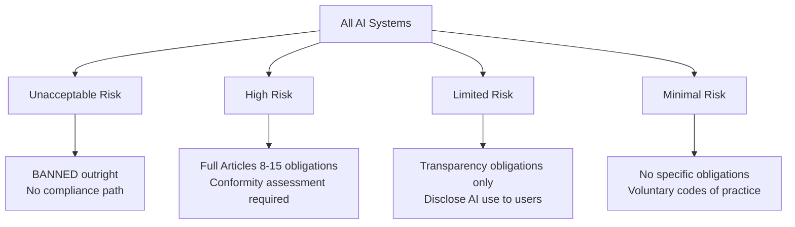
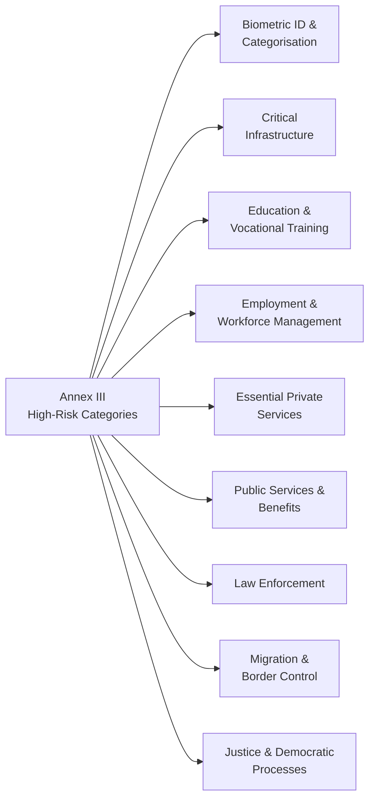

# Chapter 11: The Risk Ladder

## Not All AI Is Equal

Chapter 10 established your role: Provider, Deployer, or both. Now comes the question that determines the *weight* of your obligations: where does your AI system sit on the risk ladder?

The EU AI Act is deliberately risk-proportionate. A chatbot that recommends coffee flavours carries essentially no regulatory burden. A system that screens job applicants, assesses loan eligibility, or determines medical treatment carries the full weight of the Act. The regulation is designed so that the strictness of obligations scales with the potential for harm.

There are four tiers. Understanding where you sit is not a legal exercise — it is a product question. The answer shapes everything: your documentation requirements, your conformity assessment process, your oversight architecture, and your exposure to fines.

## The Four Tiers

### Tier 1: Unacceptable Risk — Banned

These systems are prohibited outright. There is no compliance path, no exemption process, no "we accept the risk." They simply cannot be deployed in the EU.

The prohibited categories include: AI systems that deploy subliminal techniques to manipulate behaviour without awareness; systems that exploit vulnerabilities of specific groups (age, disability, social situation); real-time remote biometric identification systems in publicly accessible spaces (with narrow law enforcement exceptions); AI used to infer emotions in workplaces or educational institutions (with limited exceptions); and social scoring systems operated by public authorities.

The ban on real-time biometric surveillance is the one most enterprises encounter in practice. Facial recognition in recruitment, gaze-tracking in remote proctoring, emotion detection in customer service calls — these are all either banned or under significant scrutiny. If your organisation is exploring any of these, stop and take legal advice before proceeding.

### Tier 2: High Risk — Full Obligations

This is where most of the EU AI Act's operational weight lives. High-risk AI systems face the complete set of Articles 8–15 obligations: quality management, technical documentation, data governance, transparency and instructions for use, human oversight, logging, accuracy and robustness requirements, and conformity assessment.

High-risk systems are defined in two ways. First, systems used in safety-critical products covered by existing EU product law (medical devices, aviation, automotive, toys, elevators) — these are listed in Annex I. Second, systems used in the specific application domains listed in Annex III — this is the list that catches most enterprise and public-sector deployments.

### Tier 3: Limited Risk — Transparency Only

Systems in this tier must disclose to users that they are interacting with an AI. Chatbots must identify themselves. Deepfake content must be labelled. Emotion recognition systems must disclose their use. That is the primary obligation.

Most AI assistants, recommendation engines, content generation tools, and customer service bots fall here. The obligations are light but real — failing to disclose AI interaction is a compliance breach.

### Tier 4: Minimal Risk — Voluntary Codes

Spam filters, AI in video games, simple recommendation systems. No mandatory obligations apply, though the Commission encourages voluntary codes of practice.

## Annex III: The List That Catches Most Organisations

Annex III is the most important section of the Act for enterprise and public-sector organisations to read carefully. It lists the categories of AI applications considered high-risk regardless of the underlying technology.

**Biometric identification and categorisation** — systems that identify individuals based on biometric data, or categorise them by protected characteristics.

**Critical infrastructure** — AI used in the management and operation of road traffic, water, gas, heating, electricity, or critical digital infrastructure.

**Education and vocational training** — AI used to determine access to educational institutions, assess students, or monitor examinations. An AI system that auto-grades essays and determines whether a student advances is high-risk.

**Employment and workforce management** — this is the category that surprises the most organisations. Any AI used for recruitment or selection of natural persons, to make or assist decisions on promotion, termination, task allocation, or monitoring of performance and behaviour, is high-risk. AI hiring tools, performance review assistants, automated scheduling systems that affect worker outcomes — all within scope.

**Access to essential private services** — AI used in credit scoring, insurance underwriting, and emergency services dispatching. If your AI system helps determine who gets a loan, who pays what premium, or which emergency call gets prioritised, it is high-risk.

**Public services and benefits** — AI used by public authorities to evaluate eligibility for benefits, assess social services, determine risk classification of individuals. The SyRI system and the Dutch childcare benefit algorithm from Chapter 9 would both be firmly in this category.

**Law enforcement** — AI used to assess the likelihood of criminal offences, for polygraphs, to assess the reliability of evidence, to profile individuals.

**Migration, asylum, and border control** — AI used to assess risks posed by migrants or asylum seekers.

**Administration of justice** — AI assisting in research or interpretation of facts and the law, or to influence courts.

## The Self-Assessment Trap

The most common mistake organisations make is arguing themselves out of Annex III classification. "Our AI doesn't *decide*, it only *recommends*." "It's used internally, not on customers." "It's just a tool that assists our HR team — humans make all the final calls."

The Act is not fooled by these framings. The question is not whether AI makes the final decision. The question is whether the AI system has a *material influence* on the outcome affecting a natural person. If a human rubber-stamps 97% of the AI's recommendations without independent review, the AI is effectively the decision-maker. If the system is used to pre-screen candidates and only flagged candidates proceed to human review, the AI is making the consequential cut.

Regulator guidance has consistently emphasised this. "Assisted decision-making" and "decision-making" are treated equivalently when the assistance is systematic and the human override rate is low.

## How to Self-Assess

Work through these questions for each AI system your organisation deploys:

**1. Does the system make recommendations, scores, or classifications that affect individuals' rights, opportunities, or access to services?**

If yes — you are likely in Annex III territory. Continue.

**2. Does the system operate in one of the nine Annex III domains?**

Match your use case against the list above. If yes — you are high-risk. Move to full Articles 8–15 obligations.

**3. What is the human override rate?**

If your team is reviewing AI outputs but overriding fewer than 10–15% of recommendations, document the review process carefully. Regulators will scrutinise whether human oversight is genuine or nominal.

**4. Could a wrong output cause harm to a specific person — financial, professional, physical, social?**

If yes and the system is used at scale — err toward high-risk classification and the full obligation set. The cost of over-compliance is documentation. The cost of under-compliance can be up to 3% of global annual turnover.

## A Note on the "Significant Risk" Threshold

The Act includes a notable carve-out: some systems that technically fall into Annex III categories may be excluded if they are used for narrow, preparatory purposes and the AI output is not directly used to make decisions about individuals.

In practice, this threshold is rarely met by real deployments. If your system is in production, affecting real people, at any meaningful scale — assume it is in scope and document accordingly.

---

## The Essentials

1. **Four tiers, one principle**: obligations scale with potential for harm. Unacceptable-risk systems are banned outright. High-risk systems face the full compliance burden. Limited-risk systems must disclose. Minimal-risk systems carry no mandatory obligations.

2. **Annex III is the operative list** for most organisations. Nine domains — employment, credit, education, public benefits, law enforcement, and more — are automatically high-risk regardless of technology.

3. **"It only recommends" is not a defence.** If AI systematically influences decisions that affect people's rights or opportunities, it is high-risk. The override rate matters.

4. **Employment AI is almost always high-risk.** Hiring tools, performance review assistants, scheduling systems that affect worker outcomes — all under Annex III.

5. **When in doubt, over-classify.** The cost of treating a limited-risk system as high-risk is documentation overhead. The cost of treating a high-risk system as limited-risk is regulatory exposure of up to €15M or 3% of global turnover.
