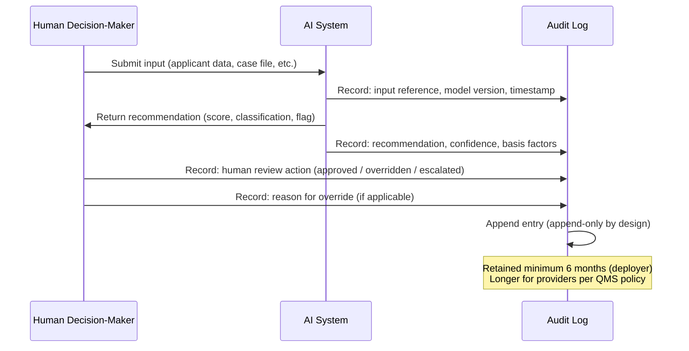

# Chapter 12: Article 12 — The Black Box Requirement

## The Problem with "We Log Everything"

Chapter 11 established where high-risk AI systems sit on the risk ladder. Now we turn to what those systems must actually do. Article 12 is the first of five core obligations — and the one most technical teams believe they already have covered.

They do not.

When a technical team hears "logging requirement," they think of what their systems already produce: server access logs, API call records, database query histories, error traces. These are logs in the engineering sense. Article 12 is not asking for engineering logs. It is asking for something the Netherlands Tax Authority's childcare benefit algorithm conspicuously lacked: a record sufficient to reconstruct *what the AI recommended*, *why*, *when*, *under what conditions*, and *what a human decided to do about it* — years after the fact, in a context an auditor can navigate.

These are two entirely different things.

Article 12 is, at its core, a decision accountability obligation. The question it answers is not "did your system run?" but "when your system made a recommendation that affected a person's life, what is the documented record of that decision — and what did a human do about it?"

## What Article 12 Actually Requires

Article 12 of the EU AI Act requires high-risk AI systems to automatically generate logs of operation throughout their lifecycle. The logs must:

- Enable the monitoring of the operation of the high-risk AI system
- Ensure traceability of the system's functioning
- Allow for post-market monitoring
- Support the identification of risks and anomalies
- Be retained for a period appropriate to the purpose, with a minimum of six months for deployers of high-risk AI systems

The critical word is *traceability*. A log that records that an event occurred is not the same as a log that enables the reconstruction of a decision. The difference is the difference between "the system ran at 14:32" and "at 14:32, the system scored applicant #4471 at 0.23 on hire-likelihood based on inputs X, Y, Z; the reviewing HR manager approved the rejection; no override reason was recorded."

The first is an audit log. The second is a decision record. Article 12 requires the second.

## The "Double-Hashed Database" Mistake

A common technical response to Article 12 is to store the AI system's inputs and outputs in a database, hash them for tamper-evidence, and consider the job done. This approach misses the obligation in two fundamental ways.

**First, hashing inputs and outputs does not produce a navigable record.** An auditor investigating a complaint from a rejected applicant cannot query a hash database for "show me every decision involving applicant #4471, what the AI said, what a human decided, and whether there was a review." The data is there in technical terms — but it is not *accessible* in the audit sense.

**Second, storing prompts and outputs captures what the system produced — not what happened next.** Article 12 is interested in the decision cycle, not just the model's output. A hiring system that logged every resume score but recorded nothing about whether a human reviewed the score, what they did with it, or whether there was any oversight mechanism — has extensive logs and zero compliance.

The obligation is to create a *decision trail*, not a *data trail*.

## What a Compliant Audit Trail Looks Like



A compliant Article 12 log captures, for each decision cycle:

1. **Input reference** — not necessarily the raw data (which may raise GDPR questions), but a reference to what was submitted and when
2. **System version** — which model, which version, which configuration was active
3. **Recommendation** — what the system output, including confidence levels or scores where applicable
4. **Basis** — the primary factors or features that drove the recommendation (where the system makes these available)
5. **Human action** — what the human decision-maker did with the recommendation
6. **Override record** — if the human departed from the AI recommendation, why
7. **Timestamp chain** — when each step occurred, in sequence
8. **Integrity marker** — evidence that the record has not been modified after the fact

Items 5, 6, and 7 are where most deployments fail. The AI logs its output. The human acts. No connection between the two is recorded — because no system was designed to capture it. Most organisations cannot currently produce a decision record that links recommendation to human action. Engineering logs are fragmented across systems. Human decisions are undocumented. The gap is structural, not incidental.

## The Retention Question

Article 12 specifies that deployers of high-risk AI systems must retain logs for a minimum of six months. Providers must define retention periods in their quality management systems, calibrated to the purpose.

Six months is a floor, not a target. In practice:

- **Employment decisions** — retain for the duration of any possible challenge period, typically 2–3 years post-decision
- **Credit and insurance decisions** — retain for the duration of the financial relationship plus applicable limitation periods
- **Public benefits decisions** — retain per national administrative law, often 5–7 years
- **Medical or safety decisions** — retain per sector-specific regulation, often 10+ years

The question to ask is not "what does Article 12 require?" but "if a regulator opens an investigation into a decision we made with AI two years ago, do we have what they need?" If the answer is no, your retention policy is insufficient.

## Tamper-Evidence: What It Actually Means

Article 12 does not use the word "tamper-evident" explicitly, but the obligation to enable traceability and support investigation implies it. A log that can be retrospectively modified — where a record of an AI recommendation can be deleted, edited, or backdated — is not a compliant audit trail. It is evidence of a concealment mechanism.

Practical tamper-evidence does not require a blockchain or a complex cryptographic system. It requires:

- Append-only storage (records can be added but not modified or deleted)
- Sequential integrity (each record references the previous, making gaps detectable)
- Access controls (the system that writes the log cannot also modify or delete it)
- Periodic integrity verification (automated checks that the log has not been altered)

Many off-the-shelf logging solutions provide these properties. The question is whether they are applied specifically to the *decision record* rather than just the system's operational logs.

One caveat matters for a local-first record like IRP's. Append-only storage and sequential integrity catch accidental loss and casual editing, but a ledger held entirely by its owner is not, on its own, tamper-evident against that owner: a motivated party with filesystem access can rewrite history and recompute any local chain. Genuine tamper-evidence depends on the third property above (the writer cannot also rewrite the log) and is achieved by anchoring a snapshot digest to an independent external witness, such as a trusted timestamp authority. IRP is append-only by application design today; external anchoring is the mechanism that makes a snapshot verifiable to an outside party. See the [Trust model](../TRUST.md).

## Why Existing Systems Fail Article 12 — and What Is Structurally Required

Most organisations discover this problem at their first audit. Engineering logs show the AI ran. Database records show what it returned. Nothing shows what the human did next — because no system was built to capture that link. The AI recommendation and the human decision exist in separate systems that were never designed to speak to each other.

At the volume of decisions most high-risk deployments process, this cannot be patched retrospectively. Asking reviewers to manually log their decisions alongside AI outputs does not scale beyond tens of decisions per day. The connection must be structural — built into the decision workflow itself, not added as an administrative step.

This is what Article 12 structurally requires: a decision record layer that sits between the AI system and the human decision-maker, capturing both sides of every consequential event in a single, append-only record where each entry links to the previous, so gaps and casual modifications are detectable (independent tamper-evidence against the storage owner requires external anchoring; see the [Trust model](../TRUST.md)). This layer is not optional infrastructure. The Act makes it mandatory. The question is only how it is implemented.

IRP does not replace what Article 12 requires. It extends it — from system-level logs (what the AI did) to decision-level traceability (what a human decided, and why).

Article 12 assumes that logging system behaviour is sufficient for traceability. In practice, regulators ask organisations to explain decisions, not just system outputs. Without capturing reasoning at the moment a decision is made, that explanation becomes a reconstruction exercise — slow, inconsistent, and often incomplete. IRP shifts this from reconstruction to capture.

The IRP (Intent Record Protocol) is one implementation of this pattern: an append-only ledger that captures each material AI-assisted decision — the recommendation, the human action, the reasoning, and the timestamp — as a single structured record. Organisations can implement equivalent patterns in their own systems. But the layer must exist. Without it, Article 12 compliance is not achievable at scale.

The ledger is the audit trail. The audit trail is the compliance evidence.

If your decision record gap is significant, closing it is your first compliance priority.

Once the record exists, `irp export evidence` generates a structured Article 12 evidence package directly from the ledger — every decision timestamped, sequenced, and presented as a traceable audit trail. One command. No manual assembly.

```bash
irp export evidence          # generates EVIDENCE.md from your ledger
irp export evidence --demo   # try with a built-in high-risk AI scenario
```

The output names each decision, shows what was decided and why, records who confirmed it, and presents the full set as the Article 12 record it is. That document is what you hand an auditor. The ledger is what you point to as the source of truth.

---

## The Essentials

1. **Engineering logs ≠ Article 12 logs.** Access logs, API traces, and database records are not decision records. Article 12 requires a traceable reconstruction of what the AI recommended and what a human decided.

2. **The decisive gap is human action.** Most systems log AI outputs. Almost none capture the human decision-maker's response — whether they followed the recommendation, overrode it, and why.

3. **Retention minimums are floors, not targets.** Six months is the minimum for deployers. Employment, credit, and public-sector decisions typically require 2–7 years to survive challenge periods and investigations.

4. **Tamper-evidence is mandatory.** Append-only, sequentially linked records with access controls. Not complex — but it must be designed in, not bolted on.

5. **Storing prompts in a database is not compliance.** Hash-encrypted storage captures what the model saw. Article 12 requires a record of what happened next — the human's decision and the outcome. Those are different things.
