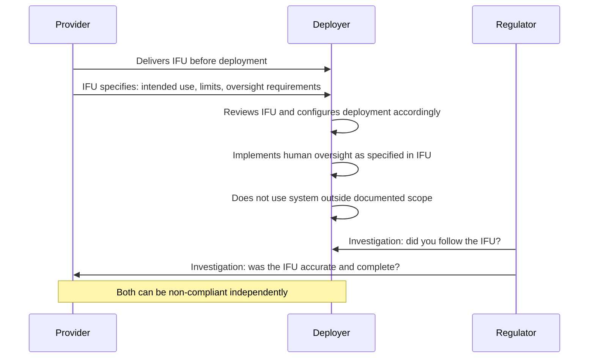

# Chapter 13: Article 13 — The Instruction Manual

## The Document No One Writes

Chapter 12 addressed the logging obligation — the internal record of what happened. Article 13 addresses something different and often overlooked: the external obligation to explain what the system is, what it does, and what its limits are — before it is deployed.

If Article 12 is the black box recorder, Article 13 is the flight manual. And in most organisations, the flight manual does not exist.

Article 13 is also a decision accountability obligation — facing outward. Where Article 12 asks whether decisions can be reconstructed internally, Article 13 asks whether the humans making decisions with AI were adequately informed to make them. A decision made with a system whose limitations were never disclosed is not a decision under genuine human control.

Article 13 requires high-risk AI systems to be sufficiently transparent for deployers to understand their operation and use them appropriately. This obligation is fulfilled through a document called the Instructions for Use — the IFU.

The IFU is not a user guide. It is not a product brochure. It is not a white paper. It is a specific, legally significant document that a Provider must produce and a Deployer must receive before the system is put into operation.

## What the IFU Must Contain

Article 13 specifies the minimum content of the IFU. For a high-risk AI system, the Instructions for Use must include:

**Provider identity** — the name, registered trade name, and address of the Provider. Who made this system and who is accountable for it.

**System characteristics, capabilities, and limitations** — what the system is designed to do, how well it does it, and what it cannot do. This includes accuracy, robustness, and cybersecurity performance data, and the conditions under which those metrics were measured.

**Purpose and intended use** — the specific purpose for which the system was developed, and the specific contexts in which it is intended to be deployed. A system designed and validated for screening software engineers is not validated for screening nurses, even if the underlying model could technically be applied.

**Known risks and foreseeable misuse** — the identified risks the system poses to health, safety, or fundamental rights, and the foreseeable ways it could be misused. This is not a theoretical exercise. It requires the Provider to have thought through failure modes and documented them.

**Human oversight measures** — the specific measures a Deployer must implement to ensure appropriate human oversight of the system's operation. Not "ensure humans are involved" — but what oversight looks like in practice: who reviews what, with what frequency, under what conditions.

**Input data requirements** — the type of data on which the system has been trained and tested, the data quality standards it assumes, and the impact of operating the system on data that differs from the training distribution.

**Maintenance and monitoring** — the expected lifetime of the system, the monitoring required, the conditions under which it should be retrained or replaced.

## The Responsibility Split

The IFU obligation creates a specific division of responsibility between Providers and Deployers.

The Provider must produce an IFU that is accurate, complete, and reflects the actual system. A Provider who issues a superficial IFU — one that does not genuinely document limitations, risks, or oversight requirements — is non-compliant.

The Deployer must follow the IFU. Using the system outside its documented scope, failing to implement the specified oversight measures, or ignoring documented limitations makes the Deployer non-compliant — regardless of whether the Provider's IFU was thorough.

An investigation by a regulator may find either or both parties non-compliant. They are assessed independently.

## What "Sufficiently Transparent" Means in Practice

The transparency standard in Article 13 is deliberately outcome-focused: the system must be transparent enough that deployers can *understand* and *use it appropriately*. This is a higher bar than it initially appears.

It is not satisfied by a document that describes the model architecture in technical terms that only ML engineers can parse. It is not satisfied by an accuracy figure presented without context (93% accuracy on what population? Under what conditions? Compared to what baseline?). It is not satisfied by a list of "limitations" that is so generic it could apply to any AI system ever built.

Sufficient transparency means a Deployer — say, an HR manager at an SME with no ML background — can read the IFU and genuinely understand:

- What will happen when they use this system to screen applications
- What kind of applicants or inputs the system was not designed for
- What the system will get wrong and how often
- What they need to do when the system flags a case for human review
- When they should override the system's recommendation
- What to do if the system produces an unexpected or suspicious result

The test is not "does the IFU exist?" It is "does a Deployer who reads the IFU know how to use the system safely?"

## The IFU as a Living Document

Article 13 implies, and the broader quality management obligations in Article 9 confirm, that the IFU is not a one-time publication. It is a living document. When the system is updated, when new risk information emerges, when the accuracy metrics change — the IFU must be updated and Deployers must receive the updated version.

This is one of the operational continuities that organisations consistently underestimate. The IFU must be versioned, its distribution must be tracked, and Deployers must be notified of material changes. A Deployer who was given an accurate IFU two years ago but never received the update documenting new limitations discovered through post-market monitoring is operating on stale information — and both the Provider and Deployer are at risk.

## On Procurement

For organisations that license AI systems from vendors: the IFU is a contractual obligation, not just a regulatory one. When you procure a high-risk AI system, the IFU must be part of the contractual deliverable. A vendor who cannot produce a compliant IFU is a non-compliant Provider, and you — as Deployer — inherit risk from that non-compliance.

The practical question to ask every AI vendor: "Can you supply an Article 13 Instructions for Use document that covers your system's intended purpose, limitations, known risks, and required oversight measures?" If they cannot, do not deploy the system.

## Why Existing Systems Fail Article 13 — and What Is Structurally Required

The IFU breaks in practice for a predictable reason: it is treated as a one-time document. Providers file it at release. Deployers sign off during procurement. When the system is updated six months later, the IFU is not. The Deployer operates on stale information, possibly making consequential decisions under limitations that were documented after their IFU was issued — but never communicated to them.

Article 13 requires decision traceability between the IFU and the deployment. When an auditor asks "what were Deployers told this system could and could not do, when applicant 4471 was screened?" the answer requires knowing which IFU version was active at that moment — not the current version, the version then. Without a structured link between IFU versions and decision records, that question cannot be answered precisely. At any meaningful scale, it cannot be answered at all.

IRP ties each decision record to the IFU version active when the decision was made. The IFU is not a filed document — it is a versioned artefact in the same ledger as the decision. That linkage is what makes Article 12 and Article 13 coherent together: the decision record carries both the AI recommendation and the documented basis on which the Deployer was expected to act.

The IRP Compliance Assessment includes a dedicated section on IFU documentation (Questions 6–8).

---

## The Essentials

1. **The IFU is a specific legal document.** Not a user guide, not a white paper, not a vendor data sheet. It is the formal record of what the system is designed to do, what its limits are, and what the Deployer must do to use it safely.

2. **Both Providers and Deployers have independent obligations.** Providers must produce a complete, accurate IFU. Deployers must follow it and must not use the system outside its documented scope.

3. **"Sufficient transparency" is an outcome standard.** The IFU must be comprehensible to a non-technical Deployer — not just technically complete.

4. **The IFU is a living document.** System updates, new risk findings, accuracy changes — all trigger an IFU update. Versioning and Deployer notification are part of the obligation.

5. **The IFU is a procurement requirement.** If your AI vendor cannot produce a compliant IFU, do not deploy the system. Their non-compliance as a Provider creates risk for you as a Deployer.
