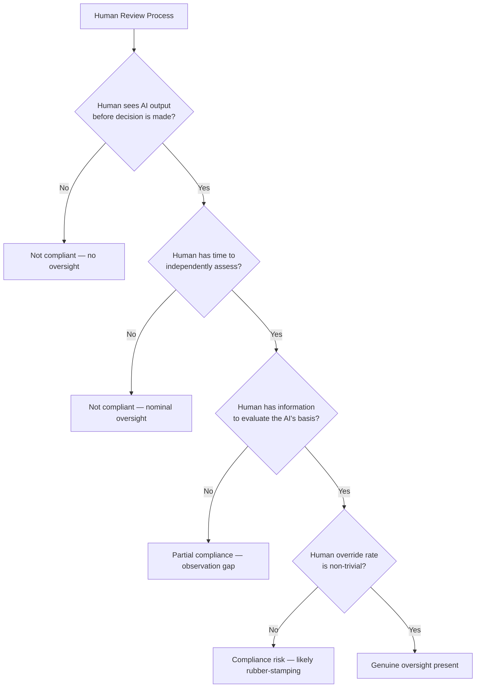

# Chapter 14: Article 14 — The Human in the Loop

## The Phrase That Does Not Mean What You Think

Chapter 13 addressed the instruction manual — what the system is and what Deployers need to know before they use it. Article 14 addresses what happens during use: specifically, whether a human being is genuinely in control of the decisions the AI system influences.

"Human in the loop" is one of the most overused phrases in enterprise AI. Teams use it to describe everything from a human who has the theoretical ability to override an AI recommendation, to a human who sees the AI output alongside other data, to a human who simply clicks "confirm" on whatever the system recommends. The EU AI Act is not interested in human presence. It is interested in human *control*. These are not the same thing.

Article 14 is the third dimension of decision accountability. Article 12 requires a record of the decision. Article 13 requires the human to be informed before making it. Article 14 requires that the human was genuinely in control when it was made — not present, not notified, but *in control*.

Article 14 requires that high-risk AI systems are designed and developed in a way that enables their oversight by natural persons during the period in which the AI system is in use. That oversight must be *effective* — not nominal, not theoretical.

## What Article 14 Requires

The human oversight obligation under Article 14 has four concrete dimensions:

**1. Comprehension** — The human overseeing the system must be able to understand the AI system's capacities and limitations. Not in technical terms — in operational terms. They need to know what the system is good at, what it gets wrong, and when to distrust its output.

**2. Observation** — The human must be able to observe, in real time during operation, what the system is doing. Black-box systems that produce outputs without any visibility into the basis for those outputs make genuine oversight impossible.

**3. Intervention** — The human must have the actual ability to intervene, override, or stop the system. Not just in theory. Not just with a formal escalation process that takes days. In the moment the system produces an output that the human judges to be wrong.

**4. Halt authority** — In the extreme case, the human must be able to halt the system's operation entirely — to stop it producing outputs until the issue is resolved.

These four requirements interact. A system that enables observation but not intervention is not compliant. A system that enables intervention in theory but whose operational workflow makes intervention practically impossible (because the AI recommendation is already in the customer-facing system before a human has reviewed it) is not compliant.

## The Nominal vs Genuine Oversight Test

The most important practical question Article 14 creates is not "do we have a human review process?" but "is that review process genuine?"

Regulators have begun developing the concept of "meaningful human control" — borrowed from autonomous weapons discourse — and applying it to AI oversight. A human who reviews an AI recommendation in three seconds, without access to the basis for the recommendation, without any training on when to override, and who overrides fewer than 2% of recommendations, is not exercising meaningful control. They are providing plausible deniability.

The override rate is a diagnostic, not a compliance metric. Low override rates are not automatically a problem — if the AI system is accurate and the human has genuinely reviewed and agrees with most outputs, that can be valid. But a low override rate combined with high processing volumes, short review times, and lack of visible reasoning suggests something else: automation with a human rubber stamp.

If you are a Deployer, audit your override rate. If it is suspiciously low, investigate why. Is it because the system is excellent? Or because the review process creates no practical space for genuine override?

## The Training Obligation

Article 14 implies — and Article 26's deployer obligations make explicit — that humans responsible for oversight must be *adequately trained* to perform that oversight. This is not a soft requirement. A deployment that assigns oversight responsibility to a team member who has received no training on the AI system's outputs, limitations, or override procedures does not meet the standard.

What adequate training looks like:

- Understanding of what the system is designed to do and its validated accuracy
- Understanding of the known failure modes and the types of cases where the system is less reliable
- A clear protocol for when to accept, question, or override a recommendation
- A documented escalation path for edge cases or ambiguous situations
- Periodic refresher training when the system is updated

The training must be documented. "We showed them how to use it" is not sufficient. A record of what training was provided, when, to whom, and at what version of the system — this is what an audit will look for.

## How to Prove Human Control

The documentation of human oversight is the bridge between Articles 12 and 14. Article 12 requires a decision record. Article 14 requires genuine human control. The documentation requirement connects them: the record must capture not just the AI recommendation but the human's engagement with it.

What evidence survives an audit:

- **Review timestamps** — when did the human actually review the output? If the timestamp shows a 2-second review of a complex case, that is a red flag.
- **Override records** — when did the human depart from the AI recommendation, and what reason did they record?
- **Escalation records** — when was a case escalated to a senior reviewer or a different process?
- **Training records** — which personnel are authorised to perform oversight, what training they received, and when.
- **System configuration records** — is the system configured so that AI outputs cannot be actioned before human review, or does the workflow allow AI recommendations to flow directly to decisions without a review step?

The last point is architectural. Some systems are designed so that a human *can* review before the decision is made. Others are designed so that a human *must* review — the system cannot proceed without a documented human action. The AI Act favours the second design.

## High-Volume Deployments: The Scale Problem

The human oversight requirement breaks at scale. Most organisations cannot currently produce evidence that oversight was genuine for any significant volume of decisions. Review timestamps are not captured. Override reasoning is not recorded. The oversight process exists — the record of it does not. Without that record, an audit produces assertions, not evidence. A credit-scoring system processing 50,000 applications per day cannot have each application genuinely reviewed by a human in the same way a bespoke professional assessment can. The scale problem is real.

The Act does not resolve this tension with bright-line rules. But regulatory guidance points toward a few acceptable approaches:

**Tiered review** — full human review for borderline cases (those near decision thresholds), automated processing for high-confidence cases at both ends of the distribution, with monitoring to detect distribution drift.

**Sample auditing** — regular human review of a statistically meaningful sample of decisions, with documented findings and escalation triggers if the error rate exceeds a threshold.

**Exception handling** — human review triggered by specific signals: low confidence scores, unusual input features, cases where the affected person has challenged the output.

None of these approaches eliminates the obligation to design the system so that human intervention is *possible* in every case. They are ways of allocating human attention efficiently while preserving genuine control.

## Why Existing Systems Fail Article 14 — and What Is Structurally Required

The absence of a decision record is where Article 14 compliance breaks. Most organisations can demonstrate that a human had access to the AI output. Few can demonstrate that a human engaged with it — reviewed it, considered it, and made a documented decision. That distinction is what investigations turn on.

At scale, manual tracking of human engagement does not work. A team processing hundreds of AI recommendations per day cannot maintain a compliant oversight record through spreadsheets, case notes, or email trails. The record must be generated by the workflow itself — as a structural consequence of how decisions are processed.

This is the requirement Article 14 creates and that IRP addresses: the human decision must be a captured artefact in the same record as the AI recommendation. Not reconstructed from secondary sources. Not asserted after the fact. Generated at the moment of review, linked to the AI output, and retained with integrity. At any meaningful scale, this is the only way the oversight record can exist.

---

## The Essentials

1. **"Human in the loop" is not a compliance position.** Article 14 requires genuine human control — the ability to observe, understand, intervene, and halt the system. Theoretical override rights do not satisfy the standard.

2. **Override rate is a diagnostic.** Very low override rates in high-volume deployments signal potential rubber-stamping. Audit why, and document the conclusion.

3. **Training is mandatory and must be documented.** Personnel responsible for oversight must receive and record specific training on the system's capabilities, limitations, and override protocols.

4. **Architecture matters.** Systems where AI outputs can be actioned before human review are harder to defend than systems where human action is a required step in the workflow.

5. **The documentation must capture human engagement, not just AI output.** Review timestamps, override records, escalation logs — these are the evidence that oversight was genuine. The Article 12 decision record and the Article 14 oversight record are the same document.
