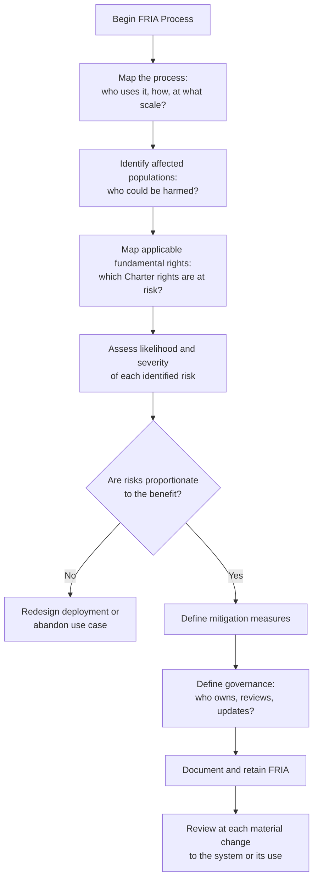

# Chapter 15: Article 27 — The Rights Audit

## The Assessment Most Organisations Have Not Heard Of

Chapters 12 through 14 covered the three most operationally intensive obligations for high-risk AI: logging, transparency, and human oversight. Article 27 introduces a fourth that is less well-known but carries significant weight for public-sector organisations and a growing set of private-sector Deployers: the Fundamental Rights Impact Assessment, or FRIA.

The FRIA is a decision accountability tool that precedes deployment. Where Articles 12 and 14 trace decisions after they happen, Article 27 demands a decision *before* deployment: is the risk to fundamental rights acceptable, and is there a documented human who made that call?

If GDPR gave organisations the concept of the Data Protection Impact Assessment (DPIA) — a structured pre-deployment analysis of privacy risks — the AI Act introduces its counterpart: an assessment of the risks to fundamental rights before a high-risk AI system is deployed.

The FRIA is not a legal fiction. It is a documented, structured analysis that must be produced, retained, and — in some cases — submitted to authorities or made available on request.

## Who Must Conduct a FRIA

Article 27 imposes the FRIA obligation on *deployers* of certain high-risk AI systems, not on all deployers of all high-risk AI systems. The obligation applies specifically to:

- **Public bodies** — any government authority, public administration, or body governed by public law using a high-risk AI system
- **Private bodies** providing public services — organisations that provide services of general interest and use high-risk AI systems in that delivery
- **Credit institutions** — banks and financial institutions using high-risk AI systems for credit scoring or related financial assessments
- **Insurance companies** — using high-risk AI systems in underwriting or claims assessment
- **Operators of critical infrastructure** — using high-risk AI systems in critical infrastructure management

The practical implication: if you are a municipality using AI to assess benefits eligibility, you must conduct a FRIA. If you are a bank using AI-assisted credit scoring, you must conduct a FRIA. If you are a private healthcare provider using AI triage, you must conduct a FRIA.

If you are an SME using AI in HR or an enterprise using AI in customer service, you may not be within the explicit Article 27 scope — but the broader transparency and documentation obligations still apply, and sector regulators may extend FRIA requirements through national implementation.

## What a FRIA Must Cover

The FRIA is a structured document. Article 27 specifies its minimum content:

**1. A description of the processes in which the AI system will be used** — not just what the system does, but the specific operational context: who uses it, what inputs it receives, what decisions it influences, at what scale.

**2. The time period and frequency of use** — when the system will operate, how often, over what horizon. A system used once for a pilot study has a different risk profile than a system processing decisions daily at scale.

**3. The categories of natural persons and groups likely to be affected** — who will be subject to decisions influenced by the system? Are any of these groups particularly vulnerable — elderly people, people with disabilities, migrants, economically precarious individuals?

**4. The specific fundamental rights at risk** — the assessment must identify which rights, as defined in the EU Charter of Fundamental Rights, are at risk from the system's use. These include the right to equality and non-discrimination, the right to privacy, the right to an effective remedy, the right to dignity, and others depending on the use case.

**5. The risk assessment** — a structured analysis of the likelihood and severity of the identified risks.

**6. Mitigation measures** — what steps will be taken to reduce the identified risks? Are those measures proportionate to the severity?

**7. Governance** — who is responsible for the FRIA, who reviewed and approved it, and how it will be updated.

## The FRIA Is Not a Checkbox

The most important thing to understand about the FRIA is what distinguishes it from a compliance checkbox: it must be *genuine*. A FRIA that identifies no meaningful risks for a system used to assess benefits eligibility of vulnerable populations is not credible. A FRIA that identifies risks but proposes no meaningful mitigation is not sufficient.

Regulators — particularly in countries with active civil society and digital rights organisations (Germany, the Netherlands, France, Sweden) — will scrutinise FRIAs. They are looking for evidence of genuine engagement with the risks, not perfunctory acknowledgement. A municipality that deploys a benefits-eligibility AI system and produces a FRIA that reads as a marketing document for the vendor will face difficult questions.

## The Relationship Between FRIA and DPIA

If your organisation has an established GDPR DPIA process, the FRIA is both familiar and distinct. The structures are similar — systematic pre-deployment risk analysis with documented mitigation — but the subject matter is different.

A DPIA asks: what are the privacy risks of this data processing, and how do we mitigate them?

A FRIA asks: what are the fundamental rights risks of this AI-assisted decision process, and how do we mitigate them?

Privacy is one fundamental right among many. A FRIA covers the full spectrum: non-discrimination, dignity, effective remedy, fair trial, equality before the law. For AI systems used in high-stakes decisions, these rights are often more at risk than privacy per se.

The practical integration: if your organisation is already required to conduct a DPIA for a data processing activity, and that activity involves a high-risk AI system subject to Article 27, run both assessments. They can share a common process and document structure, but they must address their respective questions distinctly.

## FRIA as Early Warning System

One of the underappreciated values of the FRIA — when conducted genuinely — is that it surfaces deployment problems before they become legal problems. The Dutch Tax Authority's algorithm that targeted dual-nationality families would not have survived a rigorous FRIA conducted before deployment. The questions "who are the affected populations?" and "which groups are particularly vulnerable?" would have surfaced the disproportionate impact immediately — before 26,000 families were wrongly labelled.

Organisations that treat the FRIA as an early warning mechanism — a structured challenge to their deployment assumptions — derive genuine operational value from it. Organisations that treat it as a paperwork requirement produce documents that satisfy no one and protect no one.

## Why Existing Systems Fail Article 27 — and What Is Structurally Required

The FRIA breaks as a static document. When the system changes, when the use case expands, when new risk information emerges — the FRIA must be updated. Most organisations have no mechanism to detect when an update is triggered, no version history linking each assessment to specific deployments, and no record of who made the deployment decision and under which FRIA version.

An auditor investigating a complaint will ask: what did your FRIA say when you deployed version 2.3 of this system, to this population, in this context? Without structured version management tied to the deployment decision record, that question cannot be answered precisely. The document exists. The decision record linking it to the deployment does not.

IRP treats each FRIA revision as a decision event — captured, timestamped, and linked to subsequent deployment decisions in the same ledger. This is not administrative overhead. It is the minimum structure the obligation requires: a traceable chain from "we assessed the fundamental rights risks" to "we made a documented decision to proceed."

---

## The Essentials

1. **The FRIA applies to a specific set of Deployers**: public bodies, credit institutions, insurance companies, critical infrastructure operators. If you are in this group and deploying high-risk AI, you must conduct one.

2. **The FRIA is a pre-deployment obligation.** It must be completed before the system goes live. Post-hoc FRIAs may satisfy a documentation requirement but not the intent of the obligation.

3. **It covers the full spectrum of fundamental rights** — not just privacy. Non-discrimination, dignity, effective remedy, equality before the law. Identify which are at risk in your specific deployment.

4. **A genuine FRIA may lead to "don't deploy."** That is a valid and sometimes correct outcome. A FRIA that never produces a negative recommendation is not a genuine FRIA.

5. **The FRIA is a living document.** Material changes to the system, its use, or its operational context require a revised assessment. Version control and audit trail are part of the obligation.
