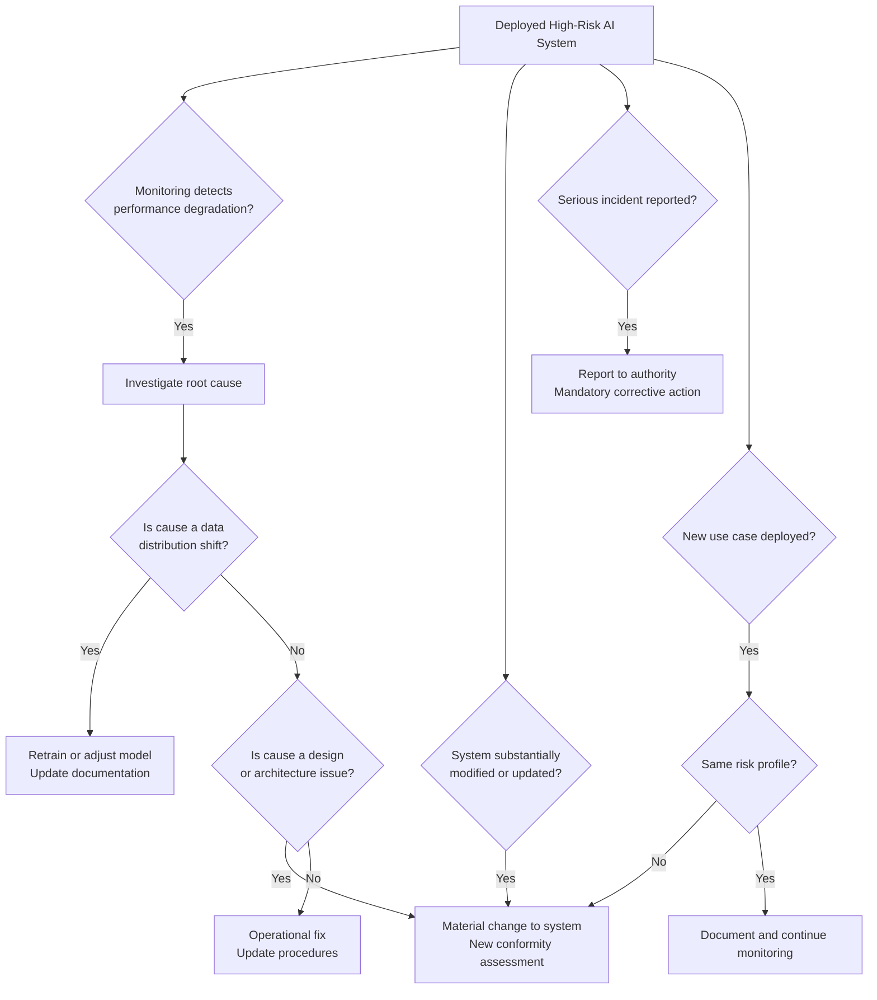

# Chapter 16: Article 72 — The Forever Job

## Compliance Is Not a Project

Chapter 15 addressed the Fundamental Rights Impact Assessment — a pre-deployment obligation. Article 72 addresses something that happens after deployment, and that never fully ends: post-market monitoring.

Most organisations approach EU AI Act compliance as a project. There are deliverables: conduct a FRIA, produce an IFU, implement logging, document human oversight procedures. The project ends when the deliverables are produced. The box is checked. Compliance is achieved.

This model is wrong, and Article 72 is the provision that makes it wrong.

Post-market monitoring is where decision accountability extends beyond deployment. Articles 12 through 15 govern how decisions are made, recorded, and assessed. Article 72 governs what happens when the system making those decisions starts to behave differently than it did when it was validated — and requires a documented human decision about what to do about it.

Article 72 requires Providers of high-risk AI systems to establish, document, and implement a post-market monitoring system — a continuous, systematic mechanism for gathering and reviewing information about the system's performance, risks, and impacts once it is deployed. Post-market monitoring is not a retrospective audit. It is a permanent operational function.

The title of this chapter is accurate: post-market monitoring under Article 72 is a permanent obligation. It runs for as long as the system is deployed. It adapts as the system changes and as new information emerges. There is no completion date.

## What Post-Market Monitoring Requires

Article 72 is more prescriptive than its short length might suggest. A compliant post-market monitoring system must:

**Be proactive.** Providers must actively gather information about performance. Waiting for complaints to arrive is not a monitoring system — it is incident response. Article 72 requires both.

**Cover actual performance in deployment.** Validation data from testing is not post-market monitoring. Monitoring uses data from real-world operation — real inputs, real outputs, real decisions, real outcomes. If the system's accuracy in deployment is materially different from its accuracy in testing (which it often is), that gap must be detected and addressed.

**Include a serious incident reporting mechanism.** Where a high-risk AI system causes or contributes to a serious incident — death, serious harm, fundamental rights violations, significant disruption — the Provider must report this to the relevant national market surveillance authority within defined timeframes.

**Trigger corrective action.** When monitoring identifies performance degradation, unexpected behaviour, or evidence of discriminatory outputs, the Provider must act: update the system, restrict its use, suspend it, or — in extreme cases — withdraw it from the market. Monitoring without consequence is not monitoring. It is observation.

**Be documented.** The monitoring system, its methodology, its findings, the actions taken in response, and the outcomes of those actions must all be documented and retained. This documentation is what regulators examine when they investigate.

## What Changes Trigger Re-Assessment

Post-market monitoring is closely linked to the question of when a system must go through a new or updated conformity assessment. Article 72 does not enumerate every trigger explicitly, but regulatory guidance and the broader logic of the Act point to several categories of change that require re-assessment:

**Substantial modification** — any change to the AI system that affects its compliance with the Act's requirements, its performance level, or its risk profile triggers a new conformity assessment. This includes model updates, significant changes to training data, changes to the decision thresholds, and architectural changes.

**Deployment in a new context** — using the system for a purpose or in a population not covered by the original conformity assessment. An employment screening system validated on one country's labour market deployed in a different country's context is not automatically covered by the original assessment.

**Monitoring findings** — systematic evidence of performance issues, discriminatory outputs, or unexpected behaviour that the original risk assessment did not anticipate requires the assessment to be revisited.

**Serious incidents** — any incident meeting the Act's definition of serious incident triggers mandatory reporting and typically requires a review of the system's design and deployment configuration.

## The Data Distribution Problem

One of the most practically important aspects of post-market monitoring is detecting and responding to data distribution shifts — the phenomenon where the real-world data the system encounters in deployment differs materially from the data it was trained on.

Distribution shifts happen for mundane reasons. An economic recession changes the population of loan applicants in ways the training data did not capture. A regulatory change alters what applicants disclose on job applications. A global pandemic changes patient presentations in ways that shift the inputs to a medical triage system.

When a distribution shift occurs, the system's validated accuracy figures become unreliable. The system may continue operating confidently — producing outputs with high confidence scores — while its actual accuracy on the new population is significantly lower. Without post-market monitoring that tracks real-world performance, this can persist for months or years.

This is not a theoretical concern. Most AI systems deployed at scale will encounter distribution shifts within two to three years of deployment. Post-market monitoring is the mechanism designed to catch this before it causes harm at scale.

## Building a Monitoring System That Actually Works

A post-market monitoring system is not a dashboard. It is a process, with defined inputs, defined analysis methods, defined thresholds that trigger action, and defined ownership.

A minimal viable monitoring system for a high-risk AI deployment includes:

**Regular performance sampling** — a statistically meaningful sample of decisions reviewed by a human, comparing AI recommendations to outcomes. Where outcome data is available (did this loan default? was this hire successful?), compare predictions to actual results. Where it is not, use internal quality review.

**Demographic parity monitoring** — regularly test whether the system's outputs differ systematically across demographic groups. An employment screening system that recommends advancing 30% of male applicants and 15% of female applicants, for equivalent qualification profiles, has a discriminatory output that monitoring must catch.

**Incident capture** — a defined process for capturing, escalating, and documenting cases where the AI system's output is suspected to have caused harm or contributed to a poor outcome. This must be accessible to the humans performing oversight, not just to the technical team.

**Periodic review cadence** — a defined schedule for reviewing monitoring data, assessing whether findings require action, and documenting the conclusion. Monthly for high-volume deployments; at minimum quarterly for lower-volume systems.

**Ownership** — a named individual or role is responsible for post-market monitoring. Not "the AI team" or "compliance" generically. A specific person accountable for the monitoring output with authority to escalate or halt the system.

Most organisations' monitoring programmes cannot produce the required evidence on demand. Findings live in analyst notes, Slack threads, or quarterly slide decks. The decision about what to do with each finding — and who made it — is undocumented. That is not a monitoring programme. It is observation without accountability.

## Why Existing Systems Fail Article 72 — and What Is Structurally Required

Post-market monitoring generates findings. Those findings must produce decisions: investigate further, adjust the system, restrict its use, report to authorities. Each of these is a consequential decision that must be documented with the same rigour as the deployment decisions that preceded it.

Most monitoring programmes generate data but not decisions. Dashboards track metrics. Reviews happen informally. When a regulator asks "what did you do when monitoring detected a 12% accuracy drop in Q3?" the typical answer is "we discussed it" — with no record of who decided what, under whose authority, or what action was taken. That answer does not satisfy Article 72.

IRP maps the monitoring cycle directly to decision records: each finding is a structured input, each review is a captured decision, each action — or documented decision not to act — is a ledger entry. The result is a monitoring record that survives regulatory scrutiny not because it is elaborate, but because every significant finding has a corresponding documented human decision. At scale, this structure is the only way to demonstrate continuous, evidenced monitoring rather than reactive incident management.

The IRP Compliance Assessment includes questions on your monitoring setup (Questions 17–19).

---

## The Essentials

1. **Compliance is not a project. It is a function.** Article 72 requires a permanent, operational post-market monitoring system — not a one-time audit.

2. **Waiting for complaints is not monitoring.** Proactive performance sampling, outcome tracking, and demographic parity checks are all required. Incident response is the complement to monitoring, not a substitute.

3. **Distribution shifts are inevitable.** Real-world data diverges from training data over time. Post-market monitoring is the mechanism designed to catch this before it causes harm at scale.

4. **Serious incidents must be reported.** To the relevant national authority, within defined timeframes, with documentation. This is a legal obligation, not an internal process option.

5. **Monitoring without consequence is not compliance.** When monitoring identifies a problem, a documented decision must be made: fix it, restrict it, suspend it, or withdraw it. The decision record is the compliance evidence.
