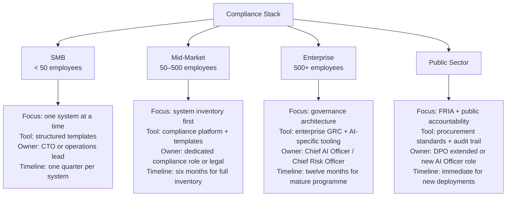

# Chapter 17: The Path Forward

## From Obligation to Capability

Chapters 9 through 16 mapped the terrain: why the EU AI Act exists, who it applies to, where your systems sit on the risk ladder, and what each of the five core obligations actually requires in practice. If you have read this far, you have the conceptual foundation. What remains is the operational question: what do you actually do?

The answer depends on where you are starting. But the framing matters first: organisations that treat EU AI Act compliance as a legal project — a bounded effort that produces documents and concludes — will spend significant resources and achieve fragile, superficial compliance. Organisations that treat it as the construction of a *capability* — a permanent function that their operations genuinely rely on — will spend similar resources and emerge with something that protects them, serves their customers, and becomes a competitive differentiator as the regulatory environment matures.

The difference between these two approaches is not ambition. It is architecture.

## The Compliance Stack by Organisation Size

The obligations are the same for every organisation within scope. The implementation looks different depending on how many systems you are running, at what scale, with what internal resources.

### SMB (fewer than 50 employees)

The EU AI Act includes provisions for SMEs — national competence authorities are required to provide guidance, simplified conformity assessment pathways may apply, and fines are capped at lower absolute amounts. But the substantive obligations are not materially reduced. An SME using AI to screen job applicants is still a high-risk deployer.

The practical SMB approach: work through one system at a time, starting with the highest-stakes deployment. For each system:

1. **Role assessment** — are you Provider, Deployer, or both?
2. **Risk tier** — is the system high-risk under Annex III?
3. **IFU review** — does your vendor supply a compliant IFU? If you built the system, does one exist?
4. **Decision logging** — is there a decision record for each significant output?
5. **Human oversight documentation** — is the oversight genuine, trained, and documented?
6. **FRIA** — if you are a public body or financial institution, is one in place?
7. **Monitoring** — is someone responsible for post-market monitoring?

This is a morning's assessment and a quarter's implementation work, per system. Not a transformation programme.

### Mid-Market (50–500 employees)

At this scale, organisations typically have multiple AI deployments across several functions (HR, customer service, operations, finance). The risk of fragmented compliance is high — different teams using different systems, none of whom are aware of each other's compliance posture.

The first priority is inventory. Before assessing any individual system, map every AI system in use across the organisation. Include: AI tools purchased from vendors, AI capabilities embedded in existing software (many SaaS products now include AI features that may meet the Act's definition of an AI system), internally built tools, and AI capabilities provided by cloud platforms.

Once the inventory exists, apply the role and risk tier assessment to each. The result is a prioritised compliance backlog. High-risk systems, especially those already in production and affecting people's rights, are priority one. Newly adopted systems should be assessed before deployment, not after.

### Enterprise (500+ employees)

Enterprise-scale AI compliance requires structural ownership — a role or function whose accountability includes AI risk management across the organisation. This may sit within Legal, within Technology Risk, within a newly created AI Governance function, or in some organisations, with a Chief AI Officer.

The structural requirements at enterprise scale:

- **AI system registry** — a maintained, auditable list of all AI systems in use, including their risk classification, responsible owner, current compliance status, and dates of key compliance activities
- **Procurement standards** — AI procurement criteria that require vendors to demonstrate compliance before contracts are signed (IFU supplied, conformity assessment completed, post-market monitoring plan provided)
- **Incident response** — a defined process for detecting, reporting, and responding to AI-related incidents that meets the Act's serious incident reporting requirements
- **Training programme** — mandatory training for all personnel who use, oversee, or make decisions influenced by high-risk AI systems
- **Governance cadence** — regular (at minimum quarterly) review of the AI system registry, monitoring findings, and compliance status

### Public Sector

Public-sector organisations have specific obligations under Article 27 (FRIA) and face heightened scrutiny due to the power they exercise over individuals. The priority is transparency and accountability — ensuring that citizens and oversight bodies can understand when and how AI influences public decisions.

The immediate focus for public-sector bodies:

1. Audit every AI system currently in use or in procurement
2. For any system meeting Annex III criteria, conduct a FRIA before next use or immediately for existing deployments
3. Establish transparency mechanisms: inform citizens when AI was used in a decision that affected them, and provide a meaningful process for challenging AI-influenced decisions
4. Ensure that procurement of new AI systems includes Article 13 IFU requirements as contractual obligations

## The Three Things That Fail Most Often

After the theory and the obligation mapping, three practical failures account for most compliance gaps:

**1. The vendor shield mistake.** Organisations assume that because they use a vendor's AI system, the vendor bears the compliance responsibility. This is consistently wrong. The Deployer's obligations are independent of the Provider's compliance status. Verify your vendors. Require IFUs. Audit your use against the documented scope.

**2. The one-time project mistake.** A team is assembled, compliance activities are completed, documents are filed. Six months later, the system is updated, the use case expands, the monitoring cadence lapses. The compliance work done at deployment does not transfer automatically to the changed deployment. Post-market monitoring, FRIA updates, and IFU reviews must be triggered by change events — not assumed to remain valid indefinitely.

**3. The documentation gap.** Many organisations have genuine compliance practices — humans really do review AI recommendations, training really does occur, oversight really is exercised. But the documentation does not exist. A regulator investigating a complaint will ask for evidence. "Trust us, we do this" is not evidence. The logging, the training records, the override logs, the FRIA document — these are the evidence. The practice without the record is a vulnerability.

## Starting Point: The IRP Compliance Assessment

The fastest way to understand your current position is to map it. The [IRP Compliance Assessment](https://irp-compliance.vercel.app) is a structured 20-question evaluation — covering your AI systems' risk tier, your role, your logging practices, your IFU documentation, your human oversight design, your FRIA status, and your post-market monitoring approach.

It takes approximately five minutes. It produces a scored output across the five core obligation areas, identifies your estimated regulatory fine exposure, and generates a prioritised list of the highest-leverage compliance actions for your specific situation.

The assessment is the beginning of the path, not the end. But it is a beginning built on the same structure as the Act itself — and the score it produces is a diagnostic of where your hands are on the steering wheel, and where they need to be.

## The Steering Wheel, Revisited

Every chapter in this part of the book has returned to the same core question: when an AI system makes a recommendation that affects a person's life, whose hands are on the steering wheel?

The answer the EU AI Act demands is not "the algorithm's" and not "nobody's." It demands a specific human being, at a specific organisation, accountable for a specific decision, with a traceable record of what they knew, what the system said, and what they chose to do.

This accountability is not a bureaucratic imposition. It is the condition under which trust in AI systems can be earned — and sustained. The organisations that build this accountability into their operations now, before August 2, 2026, will not just be compliant. They will be trustworthy. In the AI market of the next decade, trustworthiness will be a structural competitive advantage.

The steering wheel is yours. The question is whether you can prove it.

---

## The Essentials

1. **Compliance is a capability, not a project.** The organisations that thrive under the AI Act will be those that build AI accountability as a permanent operational function — not those who produce a one-time compliance deliverable.

2. **The compliance stack scales with your size.** SMBs: one system at a time, structured templates. Mid-market: inventory first, then prioritised backlog. Enterprise: structural ownership, procurement standards, governance cadence. Public sector: FRIA and transparency first.

3. **The three most common failures**: the vendor shield mistake (assuming the vendor's compliance covers yours), the one-time project mistake (treating deployment compliance as permanent), and the documentation gap (genuine practice without evidence).

4. **Procurement is compliance.** Requiring IFUs, conformity assessments, and post-market monitoring plans from AI vendors before contracts are signed is the most leverage-efficient compliance action most organisations can take.

5. **The assessment is the start.** Understanding your current position — role, risk tier, obligation gaps, fine exposure — is the prerequisite for everything else. The [IRP Compliance Assessment](https://irp-compliance.vercel.app) provides that baseline in five minutes. What you do with it takes longer. Start now.

---

*