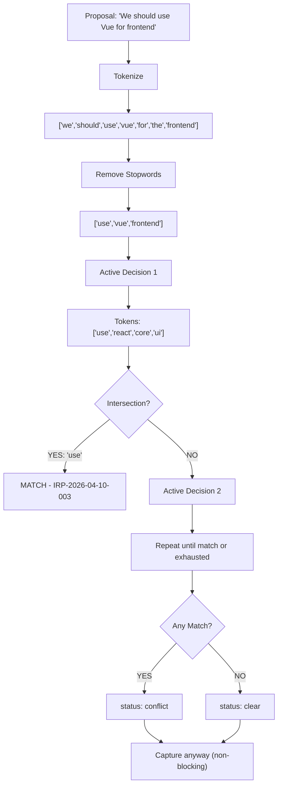
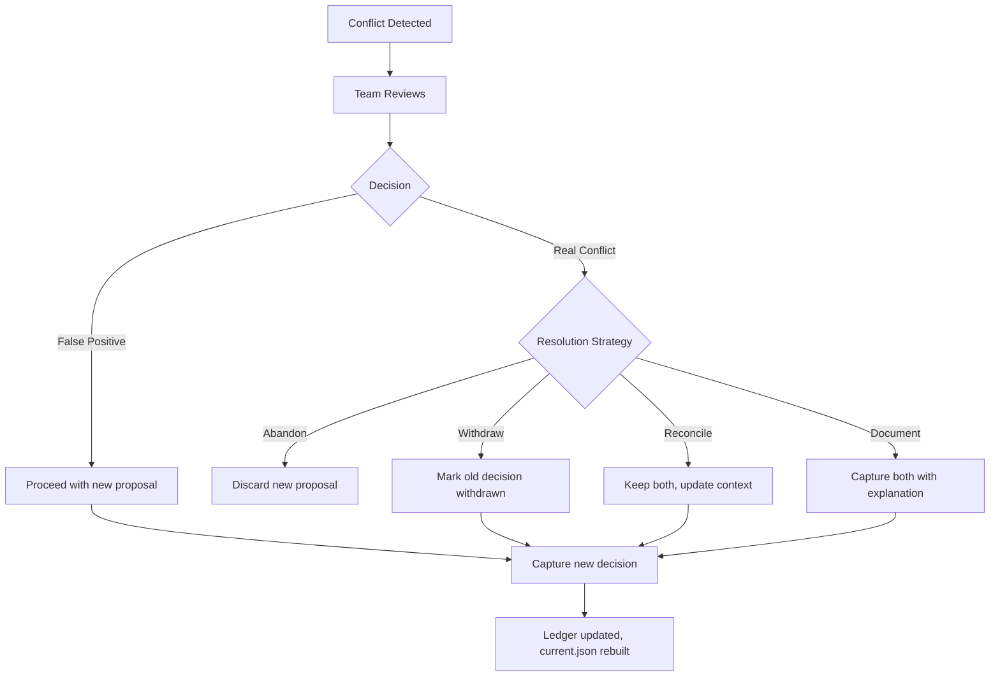

# Chapter 2: State & Conflict Detection

## The Project Bridge

`current.json` is the "project bridge"—the shared understanding of what you've decided.

When a team member asks "what have we decided about the API design?", they're asking current.json. When a Figma plugin runs conflict detection before capturing a new decision, it checks current.json. When an external AI model wants context about your project decisions, it reads current.json.

This file must be correct. And it must be consistent with the ledger it derives from.

This chapter explains how state is computed, why it's windowed, and how conflicts are detected without embeddings.

## From Ledger to Current: The Rebuild

The ledger is source of truth. But it's raw history. To get the project bridge, you rebuild:

1. Read all entries from ledger.jsonl
2. Filter to type="decision"
3. Take the last 10 (most recent first becomes tail)
4. Write to current.json

The algorithm is deterministic. Run it twice with the same ledger, get the same current.json. This means **current.json can be deleted at any time**. It's just a cache. Rebuild it from the ledger and you recover the same state.

Why deterministic? Because then current.json can be shared. One team member edits the ledger (captures a new decision). Another team member's current.json gets out of sync. No problem—rebuild. Both converge to the same state. No merge conflicts, no sync protocol.

(We'll see this rebuild process in action in Chapter 3, when a new decision is captured.)

This is the inverse of a database. In a database, you store state and log is a consequence. Here, ledger is source and current is the consequence. The direction of dependency is flipped.

## Why Last 10?

Ten decisions is arbitrary. But the window is intentional.

If current.json contained every decision ever, it would grow unbounded. Reading "we decided X in 2019" is useful for archaeology, not for making a decision today. The 10-window scopes attention to recent context.

Consequence: old decisions don't disappear. They live in the ledger. But they're not "active." If you want to understand a decision from 2024, you query the ledger by ID. Current.json is for "what should I know right now?"

The number 10 is a heuristic. In high-velocity teams, you might reduce it to 5. In slow-moving organizations, you might increase it to 20. The principle is: **window size should match decision velocity.**

## Conflict Detection: The Check Algorithm

Before capturing a new decision, the team should know: does this conflict with something we already decided?

IRP's check algorithm is lightweight. No machine learning, no embeddings, no semantic understanding. It's heuristic-based.

(This is the conflict detection we mentioned in Chapter 1's discussion of non-blocking validation. The check runs before capture to inform—never to block.)

### How It Works

The proposal is text: "We should use Vue for the frontend."

The check algorithm:
1. **Tokenize the proposal:** Split on whitespace and punctuation, lowercase, keep words only
   - "We should use Vue for the frontend" → ["we", "should", "use", "vue", "for", "the", "frontend"]

2. **Remove stopwords:** Filter out common words that don't signal conflict
   - Stopwords: "we", "should", "the", "for", "is", "a", "and", etc.
   - Result: ["use", "vue", "frontend"]

3. **Check each active decision (newest first):**
   - "Use React for the core UI because team expertise" → tokens after stopwords: ["use", "react", "core", "ui", "team", "expertise"]
   - Intersection: ["use"]
   - Match found? Check next criterion.

4. **If there's overlap, return the match:**
   - Decision: IRP-2026-04-10-003
   - What: "Use React for the core UI"
   - Why: "Team expertise, ecosystem maturity"
   - Matched on: ["use"]

5. **If no overlap in any active decision, return "clear"**

The result is status="conflict" or status="clear". Either way, the proposal is still captured (non-blocking).

### Conflict Detection Algorithm (Visual)



### Why Keyword Overlap, Not Embeddings?

Embeddings are powerful. They'd catch semantic conflicts like "Vue and React are both JS frameworks—conflict." But IRP doesn't use them. Why?

**Determinism:** Same proposal always produces same answer. With embeddings, the model could update, changing results retroactively. Keyword overlap never changes.

**Explainability:** You can see why it matched: "Proposal has words [use, frontend]. Active decision IRP-2026-04-10-003 has words [use, core, ui, frontend]. Intersection: [use, frontend]. Match."

Teams understand that. They can evaluate whether the match is real or false positive.

**Simplicity:** No dependencies on external models. No API calls, no latency, no cost.

Trade-off: keyword overlap is noisy. You'll get false positives (two unrelated decisions that share "API"). But false positives are warnings, not blockers. The team sees the warning and decides.

### The Stopword List

IRP has 48 hardcoded stopwords. They're common words that don't signal conflict:

- Articles: "a", "an", "the"
- Prepositions: "in", "to", "of", "for", "at", "by", "on", "with"
- Common verbs: "use", "add", "create", "make", "get", "set", "build", "implement", "support"
- Modifiers: "new", "good", "better", "simple", "local", "same", "more"

The stopword list is domain-specific. A list designed for infrastructure decisions would differ from one for UX decisions. The current list is general—heavy on verbs and articles.

Tuning the stopword list reduces false positives. Add "api" to stopwords if your domain is full of "use REST API" vs. "use gRPC API" conflicts. Remove "migrate" if migrations are key conflict points.

## Conflict Resolution: The Team Decides

When check detects a conflict, the proposal still gets captured. Now the team needs to resolve.

Options:

1. **Abandon the new proposal:** Don't capture it. Status changes from "conflict" to "skipped."

2. **Withdraw the old decision:** Update the ledger (add a note, mark as superseded). Capture the new proposal.

3. **Reconcile:** Update the old decision to account for the new proposal. Keep both.

4. **Document disagreement:** Capture both. Add a note explaining the tradeoff.

All options are available because the system is non-blocking. The team chooses resolution, not a policy engine.



The ledger captures this in subsequent entries:

```
{"type":"decision","id":"IRP-2026-04-12-001","what":"Use React for core UI",...}
{"type":"decision","id":"IRP-2026-04-12-002","what":"Use Vue for component library",...}
{"type":"note","id":"IRP-2026-04-12-003","what":"React vs Vue","why":"React for core, Vue for isolated components. Both JS, minimal conflict in practice.",...}
```

The ledger is a complete record of what was decided, what was superseded, and why conflicts were accepted or resolved.

## False Positives and the Cost of Warnings

Check will sometimes match decisions that aren't actually conflicting:

- Proposal: "API versioning: keep v1 backward compatible"
- Active decision: "API design: use REST principles"
- Overlap: ["api"]
- Check: "conflict detected"

Team sees it, evaluates, realizes it's not a real conflict (versioning != design). They proceed anyway.

Cost: team sees a false positive warning and dismisses it. If there are too many false positives, warnings become ignored. The stopword list needs tuning.

Benefit: catching real conflicts early outweighs false positives, as long as false positives aren't overwhelming.

IRP's philosophy: **better to over-warn than under-warn.** Teams tolerate noise if it prevents expensive conflicts. But if noise becomes 50%+ of warnings, tuning is needed.

## Current State in Context

current.json is small:

```json
{
  "version": 1,
  "active": [
    {
      "id": "IRP-2026-04-12-001",
      "what": "Use React for the core UI",
      "why": "Team expertise, ecosystem maturity",
      "confidence": "high",
      "timestamp": "2026-04-12",
      "source": "figma",
      "tags": ["frontend"]
    }
  ]
}
```

This is shared. A Slack bot can GET it via REST API. A Figma plugin can fetch it. An external AI model can ingest it. Because it's small and portable.

The full ledger is larger (thousands of entries over time). It's not typically shared. It's the authoritative archive. Current is the interface.

## Implications for Multi-Tool Workflows

When decisions flow from multiple sources, current.json becomes the convergence point.

1. Designer captures decision D1 in Figma → written to ledger → appears in current.json
2. Engineer reviews D1 in Slack (via REST API query of current.json)
3. Engineer proposes decision D2 in Slack (via CLI or bot)
4. Check runs: detects overlap with D1
5. Team resolves via a note entry
6. Updated ledger → rebuilt current.json → appears in Figma on next sync

All tools see the same current state because it derives from the same ledger.

## Summary: State as Convergence

IRP's state model is intentionally simple:

- Ledger = source of truth (append-only history)
- Current = derived view (last 10, rebuild on change)
- Check = lightweight conflict detection (keyword overlap, stopword filtered)
- Non-blocking = team decides, system informs

This design enables multiple tools to contribute decisions without sync protocols or merge logic. Everyone rebuilds from the same source. Everyone converges.

Next chapter: how do decisions actually get captured into the ledger?

## Apply This

**Pattern 1: Deterministic State Derivation**
- **Problem solved:** Consistency without sync problems, avoid dual truth
- **How to adapt:** Define rebuild algorithm, version it, keep it simple (no business logic)
- **Pitfall to watch:** Don't add mutable fields to derived state. Keep it read-only.

**Pattern 2: Windowing for Scope Management**
- **Problem solved:** Focus attention on relevant context, avoid historical noise
- **How to adapt:** Choose window size based on decision velocity. Make it configurable.
- **Pitfall to watch:** Don't lose old decisions. Keep them in ledger even if they're not in current.

**Pattern 3: Heuristics Over Machine Learning**
- **Problem solved:** Explainability, determinism, simplicity
- **How to adapt:** Build a heuristic that stakeholders understand. Document it.
- **Pitfall to watch:** Don't over-trust heuristics. They're signals, not verdicts. Team should always review.

**Pattern 4: Stopword Tuning**
- **Problem solved:** Reduce false positives without eliminating real conflicts
- **How to adapt:** Domain-specific stopword lists. Measure false positive rate. Tune.
- **Pitfall to watch:** Don't make stopword list too aggressive (you'll hide real conflicts).

**Pattern 5: Non-Blocking Validation**
- **Problem solved:** Inform without friction, let team decide
- **How to adapt:** Separate detection from enforcement. Warn clearly, let user override.
- **Pitfall to watch:** Don't let warnings become invisible noise. Monitor false positive rate.
