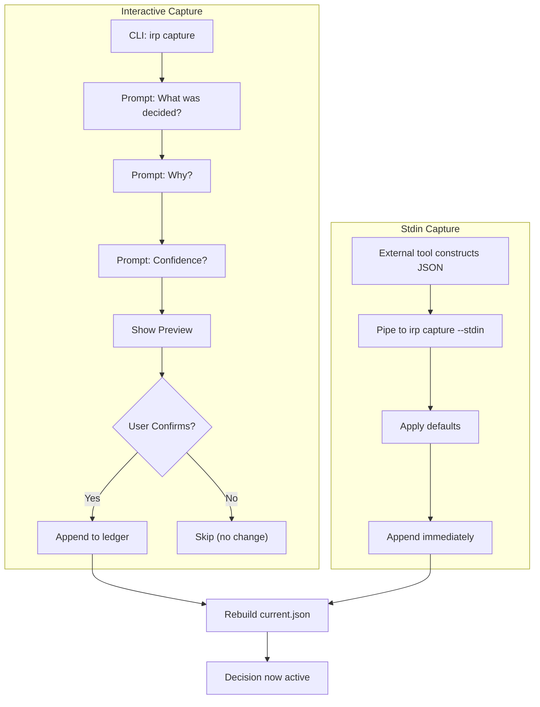

# Chapter 3: Capturing Intent

## The Moment of Decision

A decision happens. A designer finalizes a component spec. An engineer decides to refactor the database layer. A team concludes "we'll sunset this service."

At that moment, the decision is volatile. It exists in memory, maybe in Slack, maybe in a notebook. It hasn't entered the ledger yet.

IRP's capture command makes that moment sticky. It pulls the decision from wherever it lives and writes it immutably to the ledger.

This chapter: how capture works, why it has two modes, and how it integrates with external tools.

## The Capture Command: Two Modes

### Interactive Capture

A team member runs:
```bash
irp capture
```

The CLI prompts:
```
What was decided? Use React for the core UI
Why does it matter? Team expertise, ecosystem maturity
Confidence [low/medium/high]: high
```

IRP generates:
```json
{
  "type": "decision",
  "id": "IRP-2026-04-12-001",
  "what": "Use React for the core UI",
  "why": "Team expertise, ecosystem maturity",
  "confidence": "high",
  "timestamp": "2026-04-12",
  "source": "interactive",
  "tags": []
}
```

Shows a preview:
```
Candidate preview:
{
  "type": "decision",
  ...
}

Confirm capture? [c=confirm / s=skip]:
```

User types `c`. Entry is appended to ledger.jsonl. Current.json is rebuilt. Done.

If user types `s`, capture is skipped. Entry is not written. No ledger change.

Interactive capture is human-paced. The user reads the preview, confirms they match what they intended, and commits.

### Stdin Capture

An external tool constructs a candidate JSON:

```json
{
  "what": "Use React for the core UI",
  "why": "Team expertise, ecosystem maturity",
  "confidence": "high"
}
```

Pipes it to IRP:
```bash
echo '{"what":"...","why":"..."}' | irp capture --stdin
```

No prompts. No confirmation. The entry is immediately appended (after defaults are set).

Why skip confirmation? Because stdin capture is automated. The source (e.g., Figma plugin) has already validated the data. Asking for confirmation would block automated flows.

### Capture Flows (Visual)



Stdin mode is designed for bridges and sensors. Figma plugin sends POST → bridge receives → constructs JSON → pipes to `irp capture --stdin` → ledger updated.

(Before capture, teams typically run `irp check` to validate against existing decisions—we'll explore that validation flow in Chapter 4.)

## Data Enrichment: From Candidate to Entry

Both modes (interactive and stdin) enrich the candidate:

```python
candidate.setdefault("type", "decision")
candidate.setdefault("timestamp", date.today().isoformat())
candidate.setdefault("confidence", "medium")
candidate.setdefault("source", "interactive" if not args.stdin else "stdin")
candidate.setdefault("tags", [])
candidate["id"] = next_irp_id(ledger)
```

- **type:** Always "decision" (future: other types like "note", "experiment")
- **timestamp:** Today's date if not provided
- **confidence:** Default to "medium" if not specified
- **source:** "interactive" or "stdin" (overridden by sensors: "figma", "slack", etc.)
- **tags:** Empty list (can be populated for topic filtering)
- **id:** Generated sequentially

The candidate becomes an entry.

## ID Generation: Sequential Per Day

IRP generates IDs deterministically:

```python
def next_irp_id(ledger):
  today = date.today().isoformat()  # "2026-04-12"
  todays_entries = [x for x in ledger if x["timestamp"].startswith(today)]
  seq = len(todays_entries) + 1
  return f"IRP-{today}-{seq:03d}"
```

Today: IRP-2026-04-12-001, IRP-2026-04-12-002, etc.
Tomorrow: IRP-2026-04-13-001, IRP-2026-04-13-002, etc.

Benefits:

- **No collisions:** Read the ledger, count today's entries, increment. Atomic.
- **Human-readable:** Easy to understand. Easy to spot typos.
- **Date-scoped:** Can ask "what did we decide on April 12?" Just grep for "IRP-2026-04-12".
- **Deterministic:** Same ledger always produces same ID for the nth entry of a day.

Consequence: if two people run capture simultaneously, one gets 001, one gets 002 (assuming they both read the ledger before the first writes). The ID race is resolved by whatever filesystem write succeeds first. On most systems, this is safe.

## Ledger Append: Write Once, Never Modify

The capture command does:

```python
append_ledger_entry(irp_dir, entry)
```

Which opens ledger.jsonl in append mode and writes:

```python
with (irp_dir / "ledger.jsonl").open("a", encoding="utf-8") as f:
    f.write(json.dumps(entry, ensure_ascii=False) + "\n")
```

Append mode: file position jumps to end, write appends, file is not truncated.

This is atomic (on most filesystems). The line is written completely or not at all. No partial entries, no corruption.

Once written, the entry is immutable. There is no "update ledger entry" command. If you need to revise, you write a new entry that supersedes the old one:

```
{"type":"decision","id":"IRP-2026-04-12-001","what":"Use React",...}
{"type":"note","id":"IRP-2026-04-12-002","what":"React decision updated","why":"Also evaluated Vue...",...}
```

This design choice means: **the ledger is an append-only log, not a mutable store.**

## Rebuilding Current After Capture

After appending the entry, capture rebuilds current.json:

```python
updated_ledger = read_ledger(irp_dir)
current = rebuild_current(updated_ledger)
write_current(irp_dir, current)
```

This ensures current.json is immediately consistent with the new ledger state. External tools (Figma plugin, REST API) that read current.json will see the fresh decision.

If this rebuild fails, the ledger is still intact. Rebuild can be retried.

(This is the deterministic rebuild algorithm introduced in Chapter 2. The rebuild always produces the same result from the same ledger, ensuring consistency across tools.)

## Sensor Architecture: How External Tools Contribute

A sensor is an external tool that observes intent and feeds IRP.

(We introduced sensors in Chapter 1. Here we see how they work in practice.)

Design flow:
1. Designer makes a design decision in Figma
2. Designer opens IRP Figma plugin
3. Plugin shows form: "What? Why? Confidence?"
4. Designer fills form
5. Plugin sends POST to bridge server
6. Bridge server constructs entry with source="figma"
7. Bridge calls `irp capture --stdin`
8. Entry appended to ledger
9. Plugin notifies user ✓

Each sensor contributes its own metadata. Figma sensor adds: page, selection, file_key. Slack sensor would add: channel_id, thread_ts. CLI doesn't add anything extra.

The source field indicates origin. Downstream code can decide what to do with source-specific metadata.

### Why Bridge Instead of Direct?

Why does Figma sensor not write the ledger directly?

Because Figma plugins are sandboxed. They can't write the filesystem. They can only network out via HTTP.

A bridge is a local HTTP server that accepts decisions and writes them to the ledger. The bridge runs on the developer's machine, has access to the .irp/ directory, and has full write permissions.

Figma plugin → (HTTP) → Bridge (localhost) → Ledger (.irp/)

The bridge is stateless. It's just a proxy. If the bridge crashes, decisions are lost (not committed yet), but the ledger is not corrupted.

## Context Enrichment: Source-Specific Metadata

When a sensor captures a decision, it enriches it with context.

Figma bridge enriches with:
```json
{
  "what": "Use React for the core UI",
  "why": "...",
  "source": "figma",
  "context": {
    "page": "Component Library",
    "selection": "Button, ButtonGroup, ButtonIcon",
    "file_key": "abc123..."
  }
}
```

Slack sensor (future) would enrich with:
```json
{
  "source": "slack",
  "source_ref": {
    "channel_id": "C0AMXC2E069",
    "thread_ts": "1712973841.123456"
  }
}
```

The enrichment is optional. The core fields (what, why, confidence) are always required. Source-specific context is a bonus.

Design principle: **trace decisions back to origin without binding the decision to that origin.**

If the Figma file is deleted, the decision still exists in the ledger. The file_key becomes stale, but the decision is intact.

## Error Handling: What If Capture Fails?

Capture can fail at several points. The system is designed to fail gracefully:

**Bad JSON (stdin mode):**
- Error: `ValueError` during JSON parsing → exit code 1
- Recovery: Check the JSON format, fix it, retry capture
- Impact: Decision is not recorded

**No write permissions:**
- Error: `PermissionError` when appending to ledger → exit code 1
- Recovery: Check file permissions on `.irp/ledger.jsonl`, ensure bridge has write access
- Impact: Ledger is not modified; decision is not recorded

**Ledger I/O error (disk full, etc.):**
- Error: `IOError` during append → exit code 1
- Recovery: Free disk space, check filesystem health, retry
- Impact: Ledger is not modified; previous state is intact

**Ledger corruption (malformed entry):**
- Error: `read_ledger` skips malformed JSON lines, logs warning
- Recovery: Inspect `.irp/ledger.jsonl`, remove the corrupted line manually, rebuild current.json
- Impact: Corrupted entry is skipped; rest of ledger remains accessible

**Bridge unreachable (Figma plugin):**
- Error: HTTP POST to localhost:3002 fails (connection refused)
- Recovery: Ensure bridge server is running (`python3 server.py`), check port 3002
- Impact: Decision is not captured; Figma plugin shows error notification; user can retry

**Design principle:** The ledger is append-only, so failures don't corrupt it. Failed capture attempts leave no trace. Retry is always safe.

## Bootstrapping: Retroactive Capture (Future)

Teams sometimes want to retroactively capture decisions from git history or documentation. A future `irp bootstrap` command could scan git commits or docs and generate entries. This is useful for teams starting IRP mid-project. But bootstrapping is not the primary flow—most decisions are captured *when they happen*, not after.

Real-time capture (interactive or via sensors) is the intended pattern.

## Summary: Capture as the Funnel

Capture is where intent enters IRP. It's the critical funnel.

- **Interactive mode:** Human-paced, good for ad-hoc decisions
- **Stdin mode:** Automated, good for bridges
- **Sensor architecture:** Multiple sources feed into one ledger
- **Context enrichment:** Source-specific metadata without binding
- **Deterministic IDs:** No collisions, date-scoped, human-readable
- **Append-only ledger:** One write per decision, never modified

Next chapter: once a decision is in the ledger, how does IRP detect conflicts?

## Apply This

**Pattern 1: Sensor Architecture for Multi-Source Capture**
- **Problem solved:** Integrate multiple tools (Figma, Slack, etc.) without hardcoding each one
- **How to adapt:** Define bridge interface (HTTP POST, schema), implement bridge for each tool
- **Pitfall to watch:** Don't assume bridge is always available. Handle timeouts gracefully.

**Pattern 2: Stdin-Based Composition**
- **Problem solved:** Automate capture without requiring confirmation (suitable for headless flows)
- **How to adapt:** Accept JSON via stdin, skip user prompts in automated mode
- **Pitfall to watch:** Don't lose the confirmation step entirely. Keep interactive mode for humans.

**Pattern 3: Context Enrichment Without Binding**
- **Problem solved:** Trace decisions back to origin without locking them to that tool
- **How to adapt:** Store source-specific metadata in a separate context field, not inline
- **Pitfall to watch:** Don't make decision dependent on source context. If source tool dies, decision should still be usable.

**Pattern 4: Deterministic ID Generation**
- **Problem solved:** No collisions, human-readable, date-scoped
- **How to adapt:** Encode date and sequence in ID, generate from ledger state
- **Pitfall to watch:** Don't change ID format. It's a breaking change.

**Pattern 5: Append-Only Writes**
- **Problem solved:** Atomicity, auditability, immutability
- **How to adapt:** Never update, only append. If you need to revise, log a new entry.
- **Pitfall to watch:** Don't create large transactions. Keep writes small and fast.
