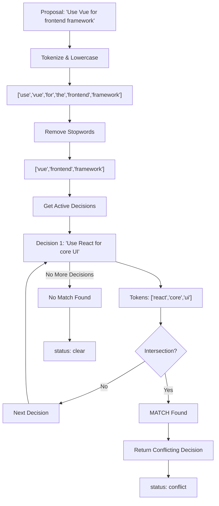

# Chapter 4: Decision Validation

## Before Commit: The Check Command

Before a decision is captured, a team member asks: "Will this conflict with something we already decided?"

The check command answers that question.

(In Chapter 2, we introduced the conflict detection algorithm conceptually. This chapter explores how teams use it in practice via the `check` command.)

```bash
irp check "Use Vue for the frontend framework"
```

IRP responds:

```
Checking proposal against project bridge (.irp/current.json)...

⚠  Potential conflict with an active project decision

  Decision:    IRP-2026-04-10-003
  What:        Use React for the core UI
  Why:         Team expertise, ecosystem maturity
  Source:      Figma

  Why surfaced: proposal overlaps with an active decision in the shared project bridge.
  Matched on:   [use, framework]
```

Status: "conflict". Exit code: 10 (non-error, but non-zero).

Or, if no conflict:

```
✓ No conflicts detected against active decisions in the shared project bridge.

  Proposal:    Use Vue for the frontend
  Checked:     5 active decisions

Status: "clear". Exit code: 0.
```

## The Check Algorithm: Keyword Overlap

Check uses heuristic matching. No machine learning, no external APIs, no scoring.

The algorithm:

1. **Tokenize the proposal**
   - "Use Vue for the frontend framework"
   - Split: ["use", "vue", "for", "the", "frontend", "framework"]
   - Lowercase (already done)

2. **Remove stopwords**
   - Stopwords: ["use", "for", "the"]
   - Filtered: ["vue", "frontend", "framework"]

3. **For each active decision (newest first)**
   - "Use React for core UI" → tokens after stopwords: ["react", "core", "ui"]
   - Intersection with proposal tokens: [] (no overlap)
   - Try next decision

4. **Another decision: "React ecosystem choices"**
   - Tokens: ["react", "ecosystem", "choices"]
   - Intersection with proposal: [] (no overlap)
   - Try next decision

5. **Another decision: "Framework is Vue or React or Angular"**
   - Tokens: ["framework", "vue", "react", "angular"]
   - Intersection: ["framework", "vue"]
   - Match found! Return this decision.

The matched decision is returned as the conflict.

### Check Algorithm (Visual)



## Why Keyword Matching, Not Embeddings?

Embeddings are tempting. A 1536-dimensional vector representing "framework decision" would catch semantic conflicts like "React vs Vue" more accurately than keywords. But IRP doesn't use embeddings. Here's why:

**Reason 1: Determinism.** Same proposal always produces the same result. With embeddings, the underlying model could improve (new training data, updated weights), changing conflict detection retroactively. A decision flagged as "clear" yesterday could become "conflict" tomorrow if the model updates. This breaks auditability.

IRP's design principle: **decisions should be auditable through time.** A conflict detection result must be reproducible.

**Reason 2: Explainability.** You can ask check "why did you match IRP-2026-04-10-003?" and get a clear answer: "Your proposal has tokens [vue, framework]. That decision has tokens [react, framework]. Overlap: [framework]."

With embeddings, the answer is "the vectors are similar" (black box). Teams can't evaluate whether the match is real or a false positive without understanding the model's reasoning.

IRP's design principle: **teams retain judgment.** Show them why, then let them decide.

**Reason 3: Cost and autonomy.** No external API calls, no rate limits, no vendor lock-in. Check runs instantly locally. Your conflict detection doesn't depend on OpenAI's servers or Claude's availability.

IRP's design principle: **decisions live locally.** They shouldn't depend on external services for critical operations.

**Trade-off:** Keyword matching has 60-80% accuracy vs embeddings' 85-95%. You'll get false positives (two unrelated decisions that share "api"). But false positives are warnings, not blockers. Teams see the warning and decide.

Better to over-warn with keyword matching than to under-warn with embeddings and hide real conflicts.

## The Stopword List: Tuning False Positives

IRP hardcodes 48 stopwords:

- Articles: "a", "an", "the"
- Prepositions: "in", "to", "of", "for", "at", "by", "on", "with"
- Common verbs: "use", "add", "create", "build", "implement", "support", "enable", "provide", "include"
- Modifiers: "new", "better", "simple", "local", "same", "more", "good", "clear", "well"
- Generic nouns: "state", "system", "project", "approach", "version"

The list is domain-general. But domains differ. A security team might add "crypto", "encrypt", "certificate" as stopwords if every decision mentions them. An infrastructure team might add "cloud", "container", "scale".

Tuning the list reduces false positives. But it's a knob, not a solution. If you make stopwords too aggressive, you'll hide real conflicts.

## Newest-First Matching: Prioritize Recent Context

The algorithm checks decisions newest-first:

```python
for entry in reversed(active):  # newest-first
    if overlap:
        match = entry
        break
```

Why? Because recent decisions are more likely to matter. If a team decided "use React" two months ago but is now asking "should we switch to Vue?", the two-month-old decision is relevant context.

If a team decided "use Vue" in a sub-project a year ago, and now the main project is asking "use React?", the old Vue decision might not apply. But check will surface it anyway (newest-first doesn't filter by relevance, only by recency).

Consequence: most conflicts are real (recent), but some are false positives (old, unrelated).

## Non-Blocking by Design

This is critical: **check detects conflicts but does not prevent capture.**

When check finds a conflict, it returns status="conflict" and exit code 10.

Exit code 10 is intentional. It's not an error (exit code 1). It's a warning. Callers can:

```python
if result["status"] == "conflict":
    print("⚠  Conflict detected")
    # Show conflict to user
    # Let user decide what to do
elif result["status"] == "error":
    print("ERROR")
    exit(1)
```

Why non-blocking? Because conflicts are informational, not policy violations.

Example: A team decides "use React." Later, they decide to "use Vue for the component library." Check would flag this as a conflict (overlap on "use"). But it's not really a conflict—it's a refinement. React for main app, Vue for components. Both decisions are valid.

If check blocked, the team would need to disable it or reformulate the decision (awkwardly: "use Vue *only* for the component library"). Non-blocking check just informs: "you're adding to what you already decided, heads up."

## Conflict Resolution: Team Decides

When check surfaces a conflict, the team has options:

1. **Abandon the proposal:** Don't capture the new decision. Stick with the old one.

2. **Withdraw the old decision:** Update ledger (add a superseding note). Capture the new decision.

3. **Reconcile:** Update the old decision to account for the new proposal. No conflict.

4. **Accept both:** Capture both decisions. Add a note explaining the tradeoff.

All are valid. The team chooses based on context that the check algorithm doesn't have.

### Example: React vs. Vue

**Old decision (IRP-2026-04-10-003):**
```
What: Use React for the core UI
Why: Team expertise, ecosystem maturity
Confidence: high
```

**New proposal:** Use Vue for the frontend

**Check detects:** Conflict on [use, framework]

**Team's choice:** "Actually, we want Vue. React was chosen before we evaluated Vue. Let's switch."

**Resolution:** Capture the new decision, add a note:

```
{"type":"note","id":"IRP-2026-04-12-001","what":"Superseding IRP-2026-04-10-003","why":"After evaluation, Vue is better for our team's familiarity...","source":"cli"}
```

**Ledger now contains both:**
- IRP-2026-04-10-003: Use React (old, superseded)
- IRP-2026-04-12-001: Use Vue (current)
- IRP-2026-04-12-002: Superseding note

Current.json now has the Vue decision (most recent). But the React decision is in ledger history. If someone asks "why did we switch from React?", the note explains.

## Example: False Positive Resolution

**Old decision (IRP-2026-04-10-002):**
```
What: Use REST API for external communication
Why: Simplicity, wide support
```

**New proposal:** Build GraphQL API

**Check detects:** Conflict on [api]

**Team's choice:** "This isn't a conflict. REST is for external communication (already decided). GraphQL is internal—different concern."

**Resolution:** Capture the GraphQL decision, no note needed.

**Ledger:**
- IRP-2026-04-10-002: Use REST API (for external communication)
- IRP-2026-04-12-003: Use GraphQL (for internal services)

Current.json has both. Team knows they made distinct decisions, not a conflict.

## Integration: Check Before Capture

In practice, check runs *before* capture (the capture process we detailed in Chapter 3).

### Interactive Flow
```
irp check "Use Vue for the frontend"
# Shows potential conflict
# User reads it

irp capture
# User confirms
# Capture runs (see Chapter 3)
# Ledger updated, current.json rebuilt
```

### Figma Plugin Flow
```
User fills form: "What? Why?"
Plugin calls: POST bridge/check
Check returns: conflict or clear
Plugin shows: conflict preview or confirmation
User clicks "Capture"
Plugin calls: POST bridge/capture
Bridge calls: irp capture --stdin
Ledger updated
```

Check is optional but recommended. You could capture without checking. But that's like committing code without CI—possible but risky.

## Programmatic Check: REST API

Check is also available via REST API:

```bash
curl -X POST http://localhost:3002/check \
  -H "Content-Type: application/json" \
  -d '{"proposal": "Use Vue for frontend"}'
```

Response:
```json
{
  "status": "conflict",
  "proposal": "Use Vue for frontend",
  "match": {
    "id": "IRP-2026-04-10-003",
    "what": "Use React for core UI",
    "why": "..."
  },
  "matched_on": ["framework", "ui"]
}
```

External tools can integrate check into their workflows via REST.

## Measuring Check Effectiveness

How many of check's detections are real conflicts vs. false positives?

Teams should monitor:

**True positive rate:** Check detected a conflict, and the team confirmed it was real.

**False positive rate:** Check detected a conflict, but the team dismissed it (false alarm).

**Miss rate:** Team made a conflicting decision but check didn't detect it.

High false positive rate (>30%) means the stopword list needs tuning. High miss rate means keywords are too restrictive.

The goal is "catch 80-90% of real conflicts with <20% false positives." Perfect accuracy is impossible (keywords are imperfect), but reasonable accuracy is achievable.

## Summary: Validation Without Blocking

Check is IRP's conflict detection system. It's:

- **Heuristic-based:** Keywords, stopword filtering, newest-first matching
- **Lightweight:** No ML, no external APIs, instant
- **Explainable:** Team can see why it matched
- **Non-blocking:** Warns but doesn't prevent
- **Optional:** Teams can choose to ignore it (not recommended)

This design reflects a philosophy: **information without policy, warning without coercion.**

Next chapter: how does a real tool (Figma) integrate IRP into its workflow?

## Apply This

**Pattern 1: Heuristic-Based Conflict Detection**
- **Problem solved:** Lightweight, explainable validation without ML complexity
- **How to adapt:** Choose a heuristic teams understand. Make it tunable.
- **Pitfall to watch:** Don't assume heuristics are perfect. They're signals, not verdicts.

**Pattern 2: Stopword Tuning for Domain**
- **Problem solved:** Reduce false positives without hiding real conflicts
- **How to adapt:** Start with generic list, tune for your domain, measure false positive rate
- **Pitfall to watch:** Aggressive tuning can hide real conflicts. Monitor continuously.

**Pattern 3: Newest-First Prioritization**
- **Problem solved:** Recent context is more relevant than old history
- **How to adapt:** Reverse iterate over active decisions, return first match
- **Pitfall to watch:** Newest-first is a heuristic, not guaranteed to be most important.

**Pattern 4: Non-Blocking Validation**
- **Problem solved:** Inform stakeholders without friction
- **How to adapt:** Use exit code 10 (warning, not error). Let team override.
- **Pitfall to watch:** Don't let warnings become invisible. Monitor false positive rate closely.

**Pattern 5: Programmatic Conflict Resolution**
- **Problem solved:** Team can evaluate conflicts and decide how to handle
- **How to adapt:** Return conflict details (what matched, why). Let team make decision.
- **Pitfall to watch:** Don't force a single resolution pattern. Teams need flexibility.
