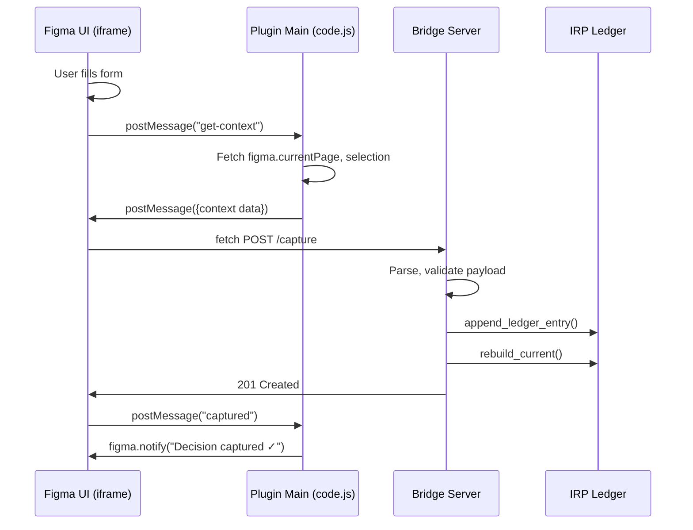

# Chapter 5: The Figma Plugin Architecture

## The Source of Design Intent

Figma is where design decisions are born. A designer finalizes a component spec. A team discusses a layout change. A decision to "use 12px as the baseline grid" emerges from critique and iteration.

These decisions happen *in Figma*. They're embedded in component properties, shared comments, version history. But they're not captured in IRP yet.

The Figma plugin is one example of a **sensor**—the external tool architecture we introduced in Chapter 3. It bridges the gap between Figma and IRP, making design decisions capturable without leaving Figma.

This chapter: the three-layer architecture, how each layer communicates, and why the bridge pattern matters.

## Three-Layer Architecture

```
┌─ Layer 1: Figma App ─────────────────────┐
│ (Sandboxed, no direct filesystem access) │
└──────────────┬──────────────────────────┘
               │ figma.ui.postMessage
               ↓
┌─ Layer 2: Plugin Main (code.js) ────────┐
│ (Figma API access, UI relay)            │
└──────────────┬──────────────────────────┘
               │ fetch (HTTP)
               ↓
┌─ Layer 3: Bridge Server ────────────────┐
│ (localhost:3002, filesystem write)      │
└──────────────┬──────────────────────────┘
               │
               ↓
           .irp/ledger.jsonl
```

**Layer 1 (Figma app):** The UI where users interact. Can't write filesystem. Embedded as iframe.

**Layer 2 (Plugin main):** Runs in Figma's plugin context. Has access to Figma APIs (current page, selection, file key). Relays messages between Figma and the iframe.

**Layer 3 (Bridge server):** Local HTTP server running on the developer's machine. Accepts decisions from plugin, writes to ledger.

Separation of concerns: each layer has one responsibility. Figma can't write filesystem, so the bridge does. The bridge is just a proxy, not policy engine.

## Layer 2: Plugin Main (code.js)

The plugin main runs in Figma's restricted context:

```javascript
figma.showUI(__html__, { width: 360, height: 480, title: "IRP Capture" });
```

This embeds the UI (`__html__` is the compiled ui.html) as an iframe.

```javascript
figma.ui.onmessage = async (msg) => {
  if (msg.type === "get-context") {
    const page = figma.currentPage.name;
    const selection = figma.currentPage.selection;
    const selectionLabel = selection.length > 0
      ? selection.map(n => n.name).join(", ")
      : null;

    figma.ui.postMessage({
      type: "context",
      page,
      selection: selectionLabel,
      fileKey: figma.fileKey
    });
  }

  if (msg.type === "captured") {
    figma.notify("Decision captured to IRP ✓");
  }

  if (msg.type === "error") {
    figma.notify("IRP bridge not reachable", { error: true });
  }
};
```

The plugin listens for three message types:

- **get-context:** UI asks for current page and selection. Plugin fetches from Figma API and sends back.
- **captured:** UI succeeded in capturing. Plugin shows success notification.
- **error:** Bridge unreachable or failed. Plugin shows error notification.

The plugin itself doesn't make decisions. It's a pure relay. All logic (form handling, validation, API calls) lives in the iframe.

### Message Flow (Visual)



## Layer 3: Bridge Server (server.py)

The bridge runs on localhost:3002. It's a stateless HTTP server.

### POST /capture Endpoint

The iframe sends a POST request:

```javascript
const response = await fetch("http://localhost:3002/capture", {
  method: "POST",
  headers: { "Content-Type": "application/json" },
  body: JSON.stringify({
    decision: "Use 12px baseline grid",
    why: "Consistency across components",
    context: {
      page: "Component Library",
      selection: "Grid, Button, Spacer"
    }
  })
});
```

The bridge receives it:

```python
def do_POST(self):
  if self.path != "/capture":
    self.send_response(404)
    return

  length = int(self.headers.get("Content-Length", 0))
  body = self.rfile.read(length)
  payload = json.loads(body)

  decision = payload.get("decision", "").strip()
  why = payload.get("why", "").strip()
  context = payload.get("context", {})

  # Construct IRP entry
  entry = {
    "type": "decision",
    "what": decision,
    "why": why,
    "confidence": "medium",
    "timestamp": date.today().isoformat(),
    "source": "figma",
    "context": context
  }

  # Append to ledger
  irp_dir = ensure_irp_dir(Path(PROJECT_ROOT))
  ledger = read_ledger(irp_dir)
  entry["id"] = next_irp_id(ledger)
  append_ledger_entry(irp_dir, entry)

  # Rebuild current
  updated_ledger = read_ledger(irp_dir)
  current = rebuild_current(updated_ledger)
  write_current(irp_dir, current)

  self.send_response(201)
  self.send_header("Content-Type", "application/json")
  self._cors_headers()
  self.end_headers()
  self.wfile.write(json.dumps({"status": "captured", "id": entry["id"]}).encode())
```

The bridge:
1. Reads the payload
2. Constructs an IRP entry (source="figma", enriched with context)
3. Appends to ledger
4. Rebuilds current.json
5. Returns 201 (Created)

All in one call. No state. No database.

### GET /comments Endpoint (Auto-Populate)

Feedback often appears as Figma comments. The bridge can fetch them:

```javascript
const comments = await fetch(
  `http://localhost:3002/comments?file_key=${fileKey}`
).then(r => r.json());
```

The bridge queries the Figma API (requires FIGMA_PAT):

```python
def do_GET(self):
  if self.path == "/comments":
    params = parse_qs(urlparse(self.path).query)
    file_key = params.get("file_key", [None])[0]
    
    comments = fetch_figma_comments(file_key)  # Figma API call
    
    self.send_response(200)
    self._cors_headers()
    self.send_header("Content-Type", "application/json")
    self.end_headers()
    self.wfile.write(json.dumps({"comments": comments}).encode())
```

This enables the UI to auto-populate a "Why" field from recent resolved comments.

Design: comments contain feedback. Feedback informs decisions. By surfacing comments, the bridge bridges the gap between discussion and decision capture.

### Cross-Origin Communication

The iframe (Layer 1) is on a different origin than the bridge (Layer 3). The bridge sends CORS headers to permit cross-origin requests, allowing the iframe to POST to the bridge without browser restrictions.

## Bridge Pattern: Why This Architecture?

Why separate bridge from IRP core?

**Reason 1: Sandbox isolation.** Figma plugins can't write the filesystem directly. A bridge intermediates.

**Reason 2: Stateless design.** The bridge is dumb. It receives a decision, writes it, returns. No caching, no logic.

**Reason 3: Extensibility.** The bridge can integrate multiple sensors. Not just Figma, but (future) Slack, Pencil.dev, etc. Each sensor POSTs to the bridge. The bridge routes to IRP.

**Reason 4: Resilience.** If the bridge crashes, the ledger is not corrupted. The bridge is just a proxy.

Consequence: You can kill the bridge, restart it, and everything still works. You can run multiple bridges against the same ledger (probably a bad idea, but possible). You can swap the bridge implementation (HTTP server written in Go, for example) without changing IRP core.

## Comment Auto-Populate: Design Rationale

Why fetch Figma comments?

Because decisions are born from discussion. A designer shares a component spec. The team comments: "love the padding", "should be 16px not 12px", "needs dark mode variant." The comments are feedback.

By fetching comments, the bridge surfaces this feedback to the decision form. The designer can select a comment as the "why" for their decision:

"Why this grid size? Comment: 'should be 16px to match buttons'"

This closes the feedback loop. The decision captures not just "what" but "why in light of team feedback."

Design principle: **trace decisions back to conversations.**

## Conflict Checking Integration

Before the form is submitted, the UI can call check—the validation command we explored in Chapter 4:

```javascript
const result = await fetch("http://localhost:3002/check", {
  method: "POST",
  body: JSON.stringify({ proposal: userInput })
});
```

The bridge proxies to IRP:

```python
from irp.core.commands.check import run_check

# In bridge handler
result = run_check(project_root, irp_dir, args)
```

If conflict detected, the UI shows the matched decision to the user before they commit.

Design: catch conflicts at decision moment, not later. The Figma plugin brings conflict detection into the designer's workflow.

## Multi-Bridge Scenarios

In large organizations, multiple bridges might run:

- **Bridge 1:** Team A's machine, port 3002
- **Bridge 2:** Team B's machine, port 3002
- **Shared ledger:** GitRepo/.irp/ledger.jsonl

Both bridges write to the shared ledger. Conflicts are resolved by git merge.

This is a future scenario, not currently supported. But the architecture makes it possible.

## Error Handling

Bridge failures are handled gracefully:

**Bridge not running:**
- Figma plugin tries POST to localhost:3002
- Network error (connection refused)
- Plugin notifies user: "IRP bridge not reachable"
- Decision is not captured

**Corrupted JSON from UI:**
- Bridge receives malformed payload
- `json.loads` throws
- Bridge responds 400 (Bad Request)
- UI shows error, user retries

**Ledger write fails:**
- append_ledger_entry throws (disk full, permissions)
- Bridge logs error
- Bridge responds 500 (Internal Server Error)
- UI shows generic error
- Ledger is not corrupted (append-only write atomic)

## Summary: The Bridge as Adapter

The bridge pattern solves the integration problem:

```
External tool (Figma) ← (HTTP) → Bridge ← (Python) → IRP core
```

The bridge translates tool-specific requests (POST decision from Figma UI) into IRP-core operations (append to ledger, rebuild current).

This is extensible. Add a Slack sensor? Add another POST endpoint to the bridge. Add an Pencil.dev plugin? Same bridge, different plugin.

The architecture reflects a principle: **tools are transient, decisions are durable.**

Next chapter: how do decisions feed back into other systems (REST API, external AI models)?

## Apply This

**Pattern 1: Bridge Pattern for Sandboxed Tools**
- **Problem solved:** Enable I/O in restricted environments (plugins, iframes, sandboxes)
- **How to adapt:** Create a bridge = local proxy with full I/O permissions
- **Pitfall to watch:** Don't assume bridge is always running. Handle network errors gracefully.

**Pattern 2: Stateless Proxy**
- **Problem solved:** Simplicity, resilience (no state to lose), easy to restart
- **How to adapt:** Bridge receives request, performs action, returns result. No caching, no side effects.
- **Pitfall to watch:** Statelessness means each request is independent. Can't maintain session context.

**Pattern 3: Message-Based Relay**
- **Problem solved:** Cross-layer communication without tight coupling
- **How to adapt:** Define message types (get-context, captured, error). Version them.
- **Pitfall to watch:** Don't overly complicate message protocol. Keep it simple.

**Pattern 4: Context Enrichment from Source Tool**
- **Problem solved:** Trace decisions back to where they were made
- **How to adapt:** Capture tool-specific context (page, selection, file_key) in decision entry
- **Pitfall to watch:** Don't create dependency on source tool context. If tool dies, decision should still be usable.

**Pattern 5: Feedback Loop via Comments**
- **Problem solved:** Close the gap between discussion and decision capture
- **How to adapt:** Auto-populate decision context from recent comments/feedback
- **Pitfall to watch:** Parsing feedback is imperfect. Don't over-automate. Let user review before capturing.
