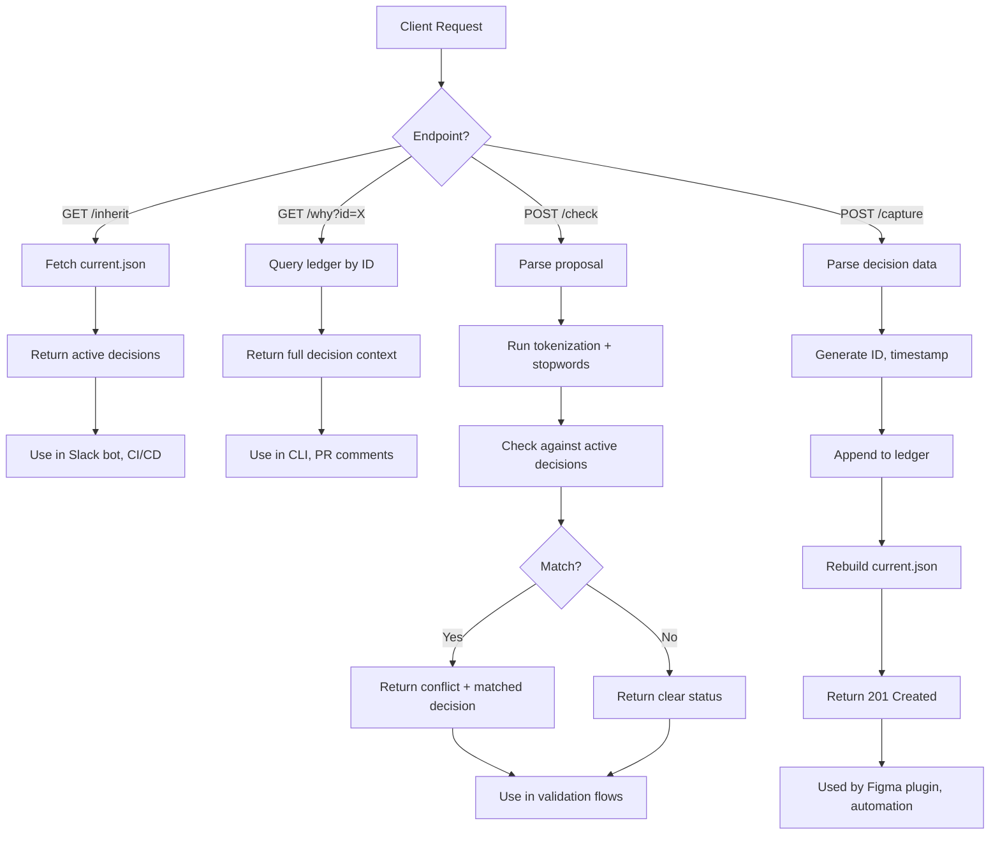

# Chapter 6: Extensibility & Cross-Engine Context

## Decisions as Portable Context

A decision captured in Figma (as we saw in Chapter 5) should inform work in Slack. Should inform Claude API calls. Should inform GitHub PRs.

This requires decisions to be portable—queryable from anywhere, injectable into any workflow.

IRP achieves this through REST APIs and context exporters. This chapter explores that architecture and shows how the sensor/capture pattern from Chapter 3 extends outward to other tools.

## REST API Layer

IRP exposes decisions via HTTP:

### GET /inherit

Returns active decisions (current.json):

```bash
curl http://localhost:3002/inherit
```

Response:

```json
{
  "version": 1,
  "active": [
    {
      "id": "IRP-2026-04-12-001",
      "what": "Use React for core UI",
      "why": "Team expertise, ecosystem maturity",
      "confidence": "high",
      "timestamp": "2026-04-12",
      "source": "figma"
    }
  ]
}
```

Use case: A Slack bot queries /inherit, displays active decisions in a message. A CI/CD pipeline queries /inherit, passes decisions to a build system.

### REST API Endpoints (Visual)



### GET /why

Query a specific decision:

```bash
curl http://localhost:3002/why?id=IRP-2026-04-12-001
```

Response:

```json
{
  "id": "IRP-2026-04-12-001",
  "what": "Use React for core UI",
  "why": "Team expertise, ecosystem maturity",
  "confidence": "high",
  "timestamp": "2026-04-12",
  "source": "figma",
  "source_ref": { "page": "Component Library", ... }
}
```

Use case: A developer reads a PR comment "why did we choose React?" can run `irp why --id IRP-2026-04-12-001` to get the full context.

### POST /check

Validate a proposal:

```bash
curl -X POST http://localhost:3002/check \
  -H "Content-Type: application/json" \
  -d '{"proposal": "Use Vue for the frontend"}'
```

Response:

```json
{
  "status": "conflict",
  "proposal": "Use Vue for the frontend",
  "match": {
    "id": "IRP-2026-04-12-001",
    "what": "Use React for core UI"
  },
  "matched_on": ["framework", "ui"]
}
```

Use case: A tool (CI/CD, bot, external system) validates a proposed change against active decisions before proceeding.

## collab.py: Context Injection for External AI

IRP decisions should inform external AI models. But those models don't have access to your .irp/ directory.

collab.py bridges that gap. It reads your decisions, injects them into a prompt, and calls an external model:

```bash
python3 tools/collab.py "Should we add a new framework?"
```

What happens:

1. **Read context:** collab.py loads current.json
2. **Format context:** Converts decisions to markdown
3. **Inject into prompt:** Creates a system message with context
4. **Call external model:** Makes API request (default: OpenAI)
5. **Return response:** Streams model output to stdout

The model sees something like:

```
You are an expert evaluating software decisions. Review the context below.

# IRP Context
## Active Decisions

IRP-2026-04-12-001
What: Use React for core UI
Why: Team expertise, ecosystem maturity
Confidence: high

...

---

User Query:
Should we add a new framework?
```

The model responds with analysis informed by your active decisions.

### Topic Filtering

Focus context on a specific area:

```bash
python3 tools/collab.py --topic "frontend" "Is Tailwind a good fit?"
```

collab.py filters to decisions mentioning "frontend" in what/why fields. Keeps context tight, reduces token usage.

### Multi-Backend Support

```bash
# OpenAI (default)
python3 tools/collab.py "..."

# Use different model
python3 tools/collab.py --model gpt-4o-mini "..."

# Use Anthropic
python3 tools/collab.py --model claude-3-sonnet \
  --api-base https://api.anthropic.com/v1 "..."

# Use local Ollama (full sovereignty)
COLLAB_API_BASE=http://localhost:11434/v1 \
python3 tools/collab.py --model llama3 "..."
```

Design: avoid AI model lock-in. Same context can be injected into multiple models for comparison.

## Cross-Tool Decision Flows

### Scenario: Multi-Tool Workflow

**Monday, Figma:**
Designer opens Figma plugin, captures: "Use 12-column grid system"
→ Written to ledger, appears in current.json

**Tuesday, Slack:**
Engineer asks: "Should we change the grid to 16 columns?"
→ Team member runs: `irp check "Use 16-column grid"`
→ Check finds conflict with Monday's decision
→ Team discusses, decides to stick with 12-column

**Wednesday, Code Review:**
New engineer asks in PR: "Why 12 columns?"
→ Reviewer runs: `irp why --id IRP-2026-04-12-001`
→ Points them to the decision: "Team aesthetic consistency, divisibility by 2/3/4"

**Thursday, Architecture Meeting:**
Team asks: "Should we standardize grid across products?"
→ Tech lead runs: `python3 tools/collab.py --topic "grid" "Is there a standard we should adopt?"`
→ Claude reads active decisions about grid, provides analysis
→ Team makes informed decision about standardization

All workflows flow from one source: .irp/ledger.jsonl

(This is the ledger-as-source-of-truth principle from Chapter 1, with current.json as the derived state we discussed in Chapter 2. Each capture (Chapter 3) rebuilds current, ensuring all tools stay in sync.)

## Conflict Detection Across Tools

When decisions come from multiple sources, conflicts can emerge. The check command we detailed in Chapter 4 runs across all tools:

**Figma sensor** (Chapter 5) captures: "Frontend should be single-page app"
**Slack sensor** suggests: "Build as microservices frontend"

Check runs during Slack capture (using the algorithm we explored in Chapter 2):
```
⚠  Conflict detected
  Active decision: Use SPA (Figma, IRP-2026-04-10-001)
  Proposal: Microservices frontend
  Matched on: [frontend]
```

Team sees conflict. Options:
- Abandon microservices proposal
- Withdraw SPA decision, adopt microservices
- Clarify: "SPA for user-facing, microservices for admin tools"
- Accept both (different contexts)

The ledger records the resolution:

```
IRP-2026-04-10-001: Use SPA for frontend
IRP-2026-04-12-002: Use microservices for admin backend
IRP-2026-04-12-003: Note — SPA for user-facing, microservices for admin. Different concerns, not conflicting.
```

All tools see the same current.json. All converge on the same understanding.

## Sovereignty Through Local Storage

Critical design principle: **IRP is local-first.**

Decisions live in .irp/ on your machine. External tools (Figma, Slack, Claude API) can *query* decisions. They cannot *own* them.

Consequence: if Figma goes down, decisions are still accessible via CLI. If Slack integration breaks, Figma still works. If Claude API rate-limits you, your decisions are unaffected.

The alternative (storing decisions in Figma, Slack, or Claude) creates vendor lock-in. If you leave Figma, decisions die with it. IRP rejects this.

Current.json is the interface. It's small, text, versionable. You can commit it to git. You can share it with collaborators. External tools read it. They don't own it.

## Extensibility: Adding New Sensors

The architecture is designed for new sensors to be added easily.

(Recall from Chapter 3 that sensors are external tools that observe intent and feed IRP. The Figma sensor in Chapter 5 is one concrete example. Here we show how the pattern scales to other tools.)

### How to Add a Slack Sensor

1. **Create bridge endpoint:** `POST /slack/capture` in bridge server
2. **Slack bot watches:** Slack bot listens for "irp capture" command or reactions
3. **Extract decision:** Parse Slack message, extract what/why
4. **Call bridge:** `curl -X POST http://localhost:3002/slack/capture -d {...}`
5. **Bridge routes to IRP:** Same as Figma (append to ledger, rebuild current)

Same bridge server, same IRP core. New sensor is just a new endpoint and listener.

**Real-world use case:** Amol Avasare, Head of Growth at Anthropic, built a custom AI agent that scans Slack conversations to surface cross-functional misalignment—places where teams are making conflicting decisions. His agent caught major conflicts that would have caused weeks of wasted effort. A Slack sensor for IRP automates exactly this: as teams discuss decisions in Slack threads, the sensor captures them into the ledger, runs conflict detection, and surfaces misalignment automatically. What took custom engineering becomes a built-in primitive. [Source: Lenny Rachitsky interview with Amol Avasare, "My biggest takeaways from Anthropic's Head of Growth," LinkedIn, April 2026 / https://www.linkedin.com/feed/update/urn:li:activity:7446932397385818112/]

### How to Add a GitHub Sensor

1. **GitHub Action:** Triggered on PR merge with a specific label
2. **Extract intent:** Read PR title, description, labels
3. **Call check:** Validate against active decisions
4. **Capture:** If clear, POST decision to bridge
5. **Comment:** POST summary comment back to PR

Same pattern. Bridge routes, IRP writes.

### How to Add Custom Integration

1. **Listen:** Watch for decision events in your tool (comment, label, status change)
2. **Construct:** Build JSON: `{what: "...", why: "...", confidence: "..."}`
3. **POST to bridge:** HTTP POST to /capture (or sensor-specific endpoint)
4. **Ledger updated:** Same process as all other sensors

Extensibility emerges from simplicity: the bridge is just a router. Each sensor is independent.

## Future: Event Webhooks

IRP currently is request-driven (sensors POST decisions, tools GET decisions). A future enhancement could add event webhooks: "When a decision is captured, notify these endpoints." This would enable CI/CD pipelines to react to architecture decisions automatically. But for now, tools pull decisions via REST API and respond accordingly.

## Measuring Adoption

How do you know IRP is being used effectively?

Signals:
- **Ledger growth:** Are teams capturing decisions? (should grow ~1-5 per week)
- **Current.json churn:** Is current.json updating? (should reflect recent activity)
- **Check hit rate:** Are proposals validated before capture? (high ratio is good)
- **Cross-tool queries:** Are tools querying /inherit, /why via REST? (indicates integration)
- **False positive rate:** What % of check conflicts are real? (should be >70%)

A healthy IRP system shows steady ledger growth, active check usage, and high confidence in conflict detection.

## Summary: Extensibility Through Simplicity

IRP's extensibility comes from four principles:

1. **Portable format:** Decisions are JSON, easily transported
2. **REST API:** Any tool can query decisions via HTTP
3. **Bridge pattern:** Sensors are independent, route through same bridge
4. **Local-first:** Source of truth is local, tools are integrators not owners

These principles enable:
- Multi-tool capture (Figma, Slack, CLI, etc.)
- Multi-tool querying (REST API, collab.py, direct file access)
- Conflict detection across tools
- Context injection into external AI models
- Minimal coupling, maximum flexibility

Next chapter: patterns and synthesis—what can you apply to your own decisions?

## Apply This

**Pattern 1: REST API for Portability**
- **Problem solved:** Enable any HTTP client to access decisions
- **How to adapt:** Expose key endpoints (/inherit, /why, /check)
- **Pitfall to watch:** Don't over-expose internal state. Version your API.

**Pattern 2: Context Injection Architecture**
- **Problem solved:** Feed decisions to external systems without modification
- **How to adapt:** Format context clearly, mark with metadata, let recipient decide how to use
- **Pitfall to watch:** Don't assume external system respects your context. Validate integration.

**Pattern 3: Topic Filtering for Scope**
- **Problem solved:** Focus context on relevant area, reduce noise and token usage
- **How to adapt:** Keyword-based or structured tags, allow filtering by topic
- **Pitfall to watch:** Overly aggressive filtering loses context. Test trade-offs.

**Pattern 4: Multi-Backend Abstraction**
- **Problem solved:** Avoid AI model lock-in, test decisions against multiple reasoning engines
- **How to adapt:** Abstract API calls, support multiple endpoints and models
- **Pitfall to watch:** Different models have different API formats. Abstraction layer needed.

**Pattern 5: Sovereignty Via Local Storage**
- **Problem solved:** Decisions survive tool changes, avoid vendor lock-in
- **How to adapt:** Keep source of truth locally, integrate selectively with tools
- **Pitfall to watch:** Don't replicate decisions to external systems. Sync is a separate concern.
