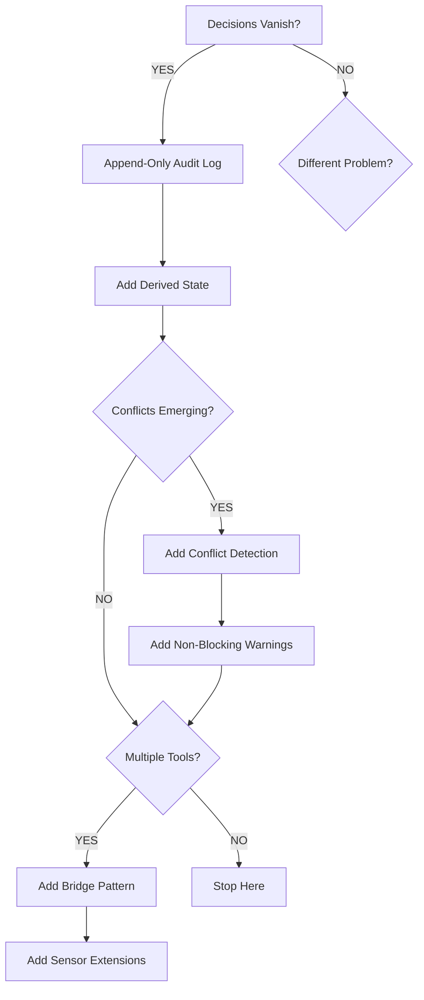

# Chapter 7: Application & Synthesis

## Which Problem Are You Solving?

You've now traversed the full IRP system:
- **Chapter 1** introduced the core problem and abstractions
- **Chapter 2** showed how state is computed and conflicts detected
- **Chapter 3** explored how decisions are captured from multiple sources
- **Chapter 4** detailed conflict validation before capture
- **Chapter 5** walked through a concrete tool integration (Figma)
- **Chapter 6** examined how decisions feed back into other systems via REST APIs and extensibility

Now: how do you apply these patterns to your own decisions?

The question isn't "which is best?" but "which solves your specific problem?"

This chapter gives guidance for different scenarios.

## Pattern-to-Problem Matching

**Problem: "Decisions disappear when tools change"**
→ Start with **append-only audit log** (Chapter 1, ledger). JSONL format is your foundation. Everything else follows.

**Problem: "Teams re-litigate the same decisions"**
→ Add **derived state** (Chapter 2, current.json). Make recent decisions visible and queryable. Don't force teams to read the entire ledger.

**Problem: "We keep making conflicting decisions"**
→ Add **lightweight heuristics** (Chapters 2 & 4, check algorithm). Keyword-based conflict detection is cheap and explainable. Don't jump to embeddings or ML models.

**Problem: "Conflicts exist but teams ignore them"**
→ Add **non-blocking warnings** (Chapter 1, Chapter 4). Surface conflicts loudly, but let teams decide. Warnings without friction are more effective than blocking rules.

**Problem: "Decisions are isolated in Figma, Slack, or CLI—never meet"**
→ Add **sensor & bridge pattern** (Chapters 3 & 5). Multiple sources, one ledger. The bridge is just a proxy; all power comes from the core.

**Problem: "Decisions should outlive the tool stack and feed my agent's memory"**
→ Add **sovereign stack integrations** (Chapter 6). IRP writes each decision to your Obsidian vault and MemPalace palace automatically. The ledger remains the canonical source; the integrations are projections.

**Start with your biggest pain point. Build the minimum pattern to solve it. Don't build bridges until the core is solid.**

## Decision Survivability: The Design North Star

Most systems optimize for: performance, consistency, correctness.

IRP optimizes for one thing: **decision survivability.**

A decision should survive:
- **Tool death:** If Figma goes down, decisions remain
- **Tool switching:** If you migrate from Figma to Pencil.dev, decisions travel
- **Schema changes:** If you add new decision fields, old decisions still make sense
- **Team changes:** If key people leave, decisions explain themselves

Design consequence: every choice reflects this priority.

**JSONL over SQLite** (Chapter 1): Text files survive tool death. Databases don't.

**Derived state** (Chapter 2): If you need to rebuild how decisions relate, you just recompute. Source is unchanged.

**Lightweight heuristics** (Chapters 2 & 4): Embeddings from last year's model become obsolete. Keyword overlap never changes.

**Non-blocking checks** (Chapters 1 & 4): A forced policy dies with the tool. Warnings survive because they inform, not enforce.

**Bridge pattern** (Chapters 3 & 5): Bridges die. Ledger doesn't. Tools come and go, but the ledger remains.

**REST API extensibility** (Chapter 6): Decisions are queried over HTTP, not locked inside tools.

The question for your domain: what happens when the tool dies?

## Tradeoffs Made in IRP

Every design reflects survivability. Here are the explicit costs:

### Ledger Format: JSONL, Not SQL

| Aspect | JSONL | SQLite |
|--------|-------|--------|
| Portability | High (text file) | Low (binary) |
| Speed | Slower (linear scan) | Faster (indexed) |
| Corruption recovery | Good (skip bad lines) | Poor (can corrupt) |
| Querying | Simple (grep) | Rich (SQL) |

**Choice:** JSONL. **Rationale:** Portability over speed.

### Conflict Detection: Keywords, Not Embeddings

| Aspect | Keywords | Embeddings |
|--------|----------|-----------|
| Explainability | High (see why) | Low (black box) |
| Determinism | Guaranteed | Model-dependent |
| Cost | Free | Expensive (API) |
| Accuracy | 60-80% | 85-95% |

**Choice:** Keywords. **Rationale:** Explainability and determinism over accuracy.

### Active Window: Last 10 Decisions

| Aspect | Last 10 | All History | Last 30 Days |
|--------|---------|-------------|-------------|
| Relevance | High (recent) | Mixed | Medium |
| Size | Small | Large | Medium |
| Scope | Focused | Unfocused | Temporal |

**Choice:** Last 10. **Rationale:** Focus and manageability over completeness.

### Validation: Non-Blocking Checks

| Aspect | Blocking | Non-Blocking |
|--------|----------|-------------|
| Safety | High (prevents bad) | Medium (requires discipline) |
| Friction | High (requires override) | Low (quick decision) |
| Team autonomy | Low (enforced) | High (team decides) |

**Choice:** Non-blocking. **Rationale:** Team autonomy and friction reduction over absolute safety.

Your domain might make different tradeoffs. The point: be explicit about costs and benefits.

## Evolution Roadmap

IRP is young. These enhancements reflect user requests and architectural possibilities:

### Phase 1: Multi-Source Capture (Q2-Q3 2026)
- **Slack sensor:** Watch threads, auto-offer capture
- **GitHub sensor:** Extract decisions from PR discussions
- **Comment threading:** Link decision to supporting conversation
- **Depends on:** User demand, team bandwidth

### Phase 2: Decision Lineage (Q4 2026)
- **Rollback semantics:** Mark decision withdrawn, preserve history
- **Dependency tracking:** "Decision A depends on Decision B"
- **Decision trees:** Group related decisions hierarchically
- **Depends on:** Phase 1 completion, database indexing

### Phase 3: Governance (2027)
- **Integration webhooks:** Notify Slack, GitHub, etc. on decision changes
- **Encrypted ledger:** Sensitive decisions (IP, strategy) with access control
- **Team-scoped decisions:** Decisions visible only to specific teams
- **Depends on:** Enterprise demand, security requirements

### Phase 4: Analytics (Ongoing)
- **Decision health:** Are teams following through?
- **Churn patterns:** How often do decisions change?
- **Conflict trends:** Which domains have most conflict?
- **Depends on:** Usage data and user feedback

**Note:** Real roadmap will diverge from this sketch. User needs drive priorities, not architectural aesthetics.

## Open Questions

IRP solves some problems but creates others:

**Q: How do you handle decisions spanning multiple projects?**
A: (Unsolved.) Current design assumes one .irp/ per project. Cross-project decisions need shared ledger or federation.

**Q: How do you share decisions with an external team without leaking context?**
A: (Unsolved.) IRP is all-or-nothing (export entire current.json). Fine-grained sharing is future work.

**Q: How do you deprecate old decisions gracefully?**
A: (Partial.) You can log a "supersedes" note. But old decision stays in ledger. Cleaner handling is future work.

**Q: How do you measure whether decisions are being followed?**
A: (Unsolved.) IRP logs decisions but doesn't track compliance. "Did we actually use React?" requires instrumentation elsewhere.

**Q: How do you make decisions searchable across large ledgers?**
A: (Unsolved.) Current system is O(n) (linear scan). With thousands of decisions, this gets slow. Indexing is future work.

Open questions are features, not bugs. They define the research frontier for IRP.

## When Decision Survivability Matters

Not every team needs decision survivability. Startups moving fast? Probably don't care if decisions die when tools change. Enterprise team with 5-year decision lineage? Different story.

Decision survivability becomes critical when:
- **Compliance requires history:** Financial, legal, security decisions must be auditable
- **Onboarding is painful:** New engineers spend weeks re-understanding what was decided
- **Tool churn is high:** You swap design tools, frameworks, platforms frequently
- **Team is distributed:** Synchronous meetings are rare; decisions need to be self-documenting
- **Knowledge loss is costly:** Someone decides something valuable, then leaves

IRP is built for these scenarios.

If you're comfortable with decisions living in Slack threads and disappearing when you migrate tools, you probably don't need IRP.

But if any of the above resonates, the patterns here matter.

## How to Read This Book Again

This book is reference material. You won't read it linearly the second time.

**Looking for:**
- **"Why JSONL instead of SQL?"** → Ch1, "Core Abstraction: The Append-Only Ledger"
- **"How does conflict detection work?"** → Ch2, "Conflict Detection Algorithm"
- **"How do I capture a decision?"** → Ch3, "Interactive Capture Flow"
- **"Why keyword matching instead of embeddings?"** → Ch4, "Why Keyword Matching"
- **"How do I set up the Figma plugin?"** → Ch5, "Layer 3: Bridge Server"
- **"How do I add a new sensor?"** → Ch6, "Adding New Sensors"
- **"What are the core design tradeoffs?"** → Ch7, "Tradeoffs Made in IRP"
- **"What's not solved yet?"** → Ch7, "Open Questions"

**By role:**
- **Decision-maker:** Read Ch1 (problem + abstractions), Ch7 (when it matters)
- **Engineer implementing IRP:** Read Ch2-Ch5 in order
- **Someone extending IRP:** Read Ch6, then Ch3-Ch5 for patterns
- **Someone evaluating IRP:** Read Ch1, Ch7 (Tradeoffs, Open Questions), Apply This sections

**Search by concept:**
- **Append-only storage:** Ch1, Ch7 (JSONL rationale)
- **Derived state:** Ch2 (current.json), Ch7 (Tradeoff table)
- **Conflict detection:** Ch2 (algorithm), Ch4 (validation)
- **Portability:** Ch6 (REST API, collab.py), Ch7 (Coda)
- **Team scale:** Ch7 (When Decision Survivability Matters)

## Closing Thoughts

IRP started from a simple observation: **decisions vanish.**

Teams choose React. Months later, they ask "why React?" No one remembers. The conversation died in Slack. The decision was lost.

IRP solves this by making decisions a first-class artifact: append-only, portable, queryable. A decision captured once is captured forever. It travels with the team, informs future choices, survives tool changes.

The patterns in IRP (audit logs, derived state, lightweight heuristics, non-blocking validation, bridge architecture) apply beyond decisions. Wherever you need something to survive system change—decisions, configurations, policies, practices—these patterns help.

The design reflects a philosophy: **simplicity, auditability, and team autonomy.**

Not the fastest system, not the richest. But one where decisions are respected, conflicts are surfaced, and teams retain agency.

That's the thesis. Apply it to your decisions.

## Apply This

**Pattern 1: Optimize for Survivability**
- **Problem solved:** Critical knowledge survives system changes
- **How to adapt:** Choose portable formats, append-only storage, deterministic computation
- **Pitfall to watch:** Survivability is invisible until the system change happens. Invest before crisis.

**Pattern 2: Expose Rationale, Not Just Decision**
- **Problem solved:** Future readers understand *why*, not just *what*
- **How to adapt:** Always include context, justification, confidence level
- **Pitfall to watch:** Rationale entries can be verbose. Make them concise.

**Pattern 3: Separate Validation from Enforcement**
- **Problem solved:** Inform teams without controlling them
- **How to adapt:** Validate broadly, enforce narrowly. Warn on policy preferences, block on safety violations.
- **Pitfall to watch:** Over-validation leads to alert fatigue. Monitor and tune.

**Pattern 4: Build for Evolution**
- **Problem solved:** System can grow without breaking existing data
- **How to adapt:** Version your data format, plan migrations, design for change
- **Pitfall to watch:** Don't change format mid-flight. Pick a scheme and commit.

**Pattern 5: Measure What Matters**
- **Problem solved:** Know whether system is actually solving the problem
- **How to adapt:** Track ledger growth, conflict detection hit rate, tool usage
- **Pitfall to watch:** Don't use metrics to shame teams. Use them to learn.

---

## Coda: The Decision That Outlives Systems

The deepest insight in IRP is this: **decisions should outlive decisions systems.**

You'll migrate away from IRP. You'll choose a different tool, a different platform. IRP's codebase will be abandoned.

But the decisions it captured should remain accessible. Portable. Queryable.

That's the promise of a JSONL ledger, a simple format, and local-first storage.

Your decisions shouldn't be held hostage by any tool. They belong to you.

IRP is just the vessel.

---

**End of Technical Book**

Estimated read time: 45-60 minutes
Estimated lines: ~1,150 (6-7 chapters, PHASE 4 draft)
