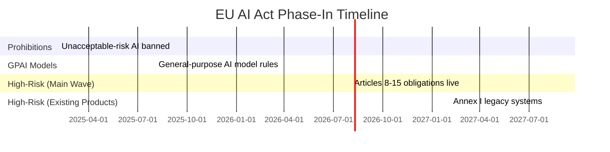

# Chapter 9: Why This Law Exists

## The Governance Gap

In 2016, a Dutch benefits agency deployed an algorithmic fraud-detection system called SyRI. It scored citizens on their likelihood of committing welfare fraud using hundreds of variables — neighbourhood, income history, employment patterns — without telling them they were being scored, what factors were used, or how to challenge a result. A Dutch court eventually struck it down in 2020. By then, thousands of people had been flagged, investigated, or denied benefits on the basis of a system no one could interrogate.

That same year, the Dutch Tax Authority was using a self-learning algorithm to flag child benefit fraud. It disproportionately targeted families with dual nationalities. Nearly 26,000 families were incorrectly labelled fraudsters and demanded to repay tens of thousands of euros. Parents lost homes. Families broke apart. The prime minister's cabinet resigned over it. The Dutch government called it "an unprecedented injustice."

These are not edge cases. They are the pattern. And they share a common feature: a consequential decision was made by a system, about a person, with no human being accountable for explaining or reviewing it.

This is the governance gap the EU AI Act exists to close.

## Why the EU AI Act Is Different from GDPR

The instinct of most organisations, when they hear "EU AI Act," is to file it next to GDPR: another compliance checkbox from Brussels, manageable with a privacy policy update and a DPA clause. This instinct is wrong, and it will prove expensive.

GDPR regulates what data you hold and how you handle it. It is, at its core, a data minimisation and consent framework. The AI Act does something structurally different: it regulates *what decisions you make* and *who is accountable* for making them. You can be fully GDPR-compliant — excellent data hygiene, lawful basis for every process, DPA signed — and still be in fundamental breach of the AI Act.

The distinction matters because it changes where compliance lives in your organisation. GDPR compliance is largely a legal and IT function. AI Act compliance is an operational function. It lives in how your teams use AI systems daily, who signs off on AI-assisted decisions, and whether there is a traceable record of what the AI said and what a human decided to do about it.

GDPR asks: *do you have consent to hold this data?*
The AI Act asks: *when this system made a recommendation, was a human actually in control — and can you prove it?*

## What "Regulation" Actually Means Here

The AI Act does not regulate algorithms. It does not require your model to be explainable in a technical sense. It does not mandate a particular architecture, framework, or vendor. Strip away the risk tiers, the conformity assessments, the Article numbers. The AI Act is not about AI. It is about decisions. Specifically: who makes them, who is accountable for them, and whether they can be reconstructed after the fact.

What it regulates is the *relationship* between AI systems and the humans they affect.

Specifically, it regulates three things:

**Accountability.** Someone must be responsible for every consequential AI system. Not "the system," not "the model provider," not "our vendor." A named legal entity — your company, in most cases — is responsible for ensuring the system behaves as intended and that affected people have recourse when it does not.

**Traceability.** When an AI system makes a recommendation that affects a person's life — a loan approval, a hiring decision, a benefits assessment, a medical triage — there must be a record of what the system said, what a human decided, and why. Not a database of raw logs. A structured, navigable, auditable trail.

**Transparency.** The people affected by AI decisions must be able to understand, in plain language, that a system was involved, what it was designed to do, and how to challenge the outcome if they believe it was wrong.

These three pillars are expressed across the Act's articles. But they all connect back to the same insight the Dutch cases exposed: systems that make consequential decisions without accountability, traceability, or transparency cause harm at scale, and that harm falls hardest on the people least equipped to challenge it.

## The Timeline You Cannot Ignore

The EU AI Act entered into force on 1 August 2024. It does not arrive all at once.

**February 2, 2025** — the ban on unacceptable-risk AI systems took effect. Social scoring by governments, real-time biometric surveillance in public spaces, subliminal manipulation techniques — these are now prohibited outright across the EU.

**August 2, 2025** — rules for general-purpose AI (GPAI) models came into force. If your organisation develops or deploys foundation models, these rules apply now.

**August 2, 2026** — the date that matters most to the majority of organisations. This is when Articles 8 through 15 — the core obligations for high-risk AI systems — become enforceable. Logging, transparency, human oversight, technical documentation, conformity assessment. This is the wave most SMBs, government agencies, and enterprise deployers are racing toward.

**August 2, 2027** — existing high-risk AI systems already embedded in legacy products (under the Machinery Directive, Medical Device Regulation, etc.) get an additional year. But this extension does not apply to new deployments.

Most organisations reading this in 2026 have one relevant date: August 2, 2026. Everything in Part IV of this book is calibrated to that deadline.

## Who Is Driving This?

Understanding why the EU AI Act passed helps you understand how it will be enforced. This is not, primarily, a technology regulation. It is a fundamental rights regulation. The European Parliament's lead committee for this legislation was the Committee on Civil Liberties, Justice and Home Affairs — not the Committee on Industry, Research and Energy, which handles most technology policy.

The legal DNA of the Act comes from the Charter of Fundamental Rights of the European Union. When the Act references "fundamental rights impact assessments" or "persons affected by high-risk AI systems," it is using the precise language of rights law, not product regulation. This shapes enforcement. Regulators will ask: *was this person harmed?* before they ask: *was this system tested?*

This also explains the Act's extraterritorial reach. If your AI system affects people in the EU — regardless of where your company is incorporated, where your servers are, or where your engineers sit — you are within scope. A Swedish logistics company using an AI hiring tool to screen EU applicants, an American SaaS vendor selling AI-powered credit scoring to Nordic banks, a Singapore-based healthcare startup deploying diagnostics in Germany: all within scope, all subject to enforcement.

The steering wheel analogy runs through the entire Act. Someone must hold it. The question the regulation asks — repeatedly, across every article — is simply: *whose hands are on it, and what happens when something goes wrong?*

---

## The Essentials

1. **The AI Act closes a specific gap**: consequential AI decisions were being made with no human accountable for explaining or reviewing them. The Dutch SyRI and childcare benefit cases are the legislative origin story.

2. **It is not GDPR**: GDPR governs data handling. The AI Act governs decision accountability. An organisation can be fully GDPR-compliant and still fundamentally breach the AI Act.

3. **Three pillars**: the Act regulates accountability (who is responsible), traceability (what record exists), and transparency (what affected people can know and challenge).

4. **August 2, 2026 is the operative date** for the vast majority of organisations. High-risk AI system obligations (Articles 8–15) become enforceable that day.

5. **Extraterritorial reach**: if your AI system affects people in the EU, you are in scope — regardless of where your company or infrastructure is located.
